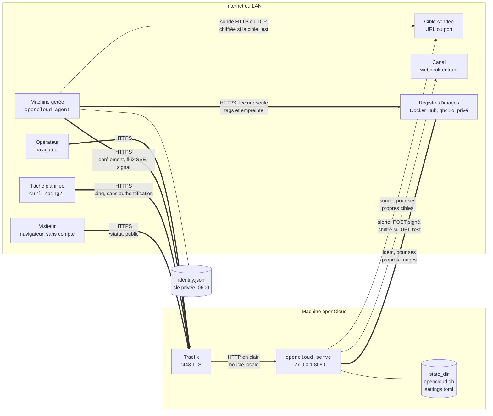

# Fonctionnement

> Ce document suit l'application. Chaque fonctionnalité intégrée y ajoute ce
> qu'elle change : un flux, un port, une donnée stockée. Dernière mise à jour :
> fonctionnalité 12, les mises à jour des images, le 22 septembre 2026.

## Les acteurs

| Acteur | Ce que c'est | Ce qu'il fait tourner |
| --- | --- | --- |
| L'opérateur | Lucas, dans un navigateur | Le front React, chargé une fois avec la page, qui lit l'API JSON et affiche |
| La machine openCloud | Le VPS où openCloud est installé | `opencloud serve` : l'API, le front embarqué, la base, et le rôle d'agent pour elle-même |
| Une machine | Un VPS, une VM, un NAS, que openCloud gère sans l'héberger | `opencloud agent` : le démon qui parle à openCloud, mesure la machine et veille son Docker |
| Docker | Le démon de conteneurs d'une machine, s'il y en a un | Les services et leurs réseaux : l'agent le lit par sa socket, en lecture seule, et ne lui demande jamais rien d'autre |
| Traefik | Le proxy de la machine openCloud | Termine TLS et transmet à openCloud sur la boucle locale |
| Une tâche | Un cron, une sauvegarde, un script, n'importe où | Un `curl` sur son URL de ping quand elle démarre ou finit |
| Une cible | Une URL ou un port qu'une sonde vérifie, dedans comme dehors | Rien : elle reçoit une requête et répond, c'est tout ce qu'on lui demande |
| Un visiteur | N'importe qui, dans un navigateur, sans compte | La page de statut publique sous `/statut` : un petit bundle à part, qui lit un instantané et un direct publics |
| Un canal | Une URL entrante : Discord, Slack, Mattermost, ntfy, un récepteur à soi | Rien : il reçoit un POST signé quand une alerte s'ouvre, s'aggrave ou se résout |
| Un registre | Docker Hub, ghcr.io, un registre privé : là d'où les images ont été tirées | Rien : il répond en lecture à l'agent de chaque machine, qui lui demande les tags d'un dépôt et l'empreinte d'un tag, jamais une image |

Un seul binaire, `opencloud`, deux rôles. La machine openCloud est une Machine
comme les autres dans l'interface, sans démon à part.

## Le schéma

Trait double : chiffré. Trait simple : en clair, mais sans quitter la machine.

## Ce qui est chiffré, ce qui ne l'est pas

| Flux | D'où à où | Chiffrement | Qui prouve quoi |
| --- | --- | --- | --- |
| Interface | navigateur → Traefik | TLS de Traefik | Personne encore : pas d'authentification dans le socle, c'est un trou connu. Le front charge la page, puis parle à `/api/…` en JSON |
| Interface | Traefik → openCloud | En clair, sur `127.0.0.1` de la même machine | Toute écriture de l'API exige la même origine : `Sec-Fetch-Site` et un corps `application/json`. Pas de cookie : rien à voler tant qu'il n'y a pas de session |
| Direct | navigateur → `/api/events`, une connexion par onglet | TLS de Traefik | Personne : le flux ne dit que « les machines ont changé », « les tâches ont changé », jamais lesquelles. Plafond de 64 onglets, `503` au-delà |
| Agent | machine → Traefik | TLS de Traefik, ou empreinte épinglée par `-pin` si pas de domaine | Ed25519 : l'agent signe un défi, openCloud vérifie avec la clé enrôlée. Le signal porte les mesures de la machine et ce que son Docker a montré ; les journaux d'un conteneur remontent par `POST /agent/logs/…`, jeton de session |
| Agent, sens retour | openCloud → machine, sur le flux ouvert | Le même flux | Le serveur pousse « suis les journaux du conteneur X », « arrête » ; l'agent ne reçoit que ce que le serveur a tiré, jamais une entrée du navigateur |
| Journaux | navigateur → `/api/services/{id}/logs/stream` | TLS de Traefik | Personne : qui atteint le port lit les journaux de n'importe quel conteneur. C'est le même trou que l'interface, en plus lourd. Une seconde connexion par onglet, plafonnée à 16 |
| Sonde | machine qui sonde → la cible | Celui de la cible : TLS si la sonde est en `https://` ou si une sonde TCP demande la poignée de main, rien sinon | Personne : une sonde n'est pas authentifiée, elle regarde du dehors comme n'importe qui. Un certificat refusé rend l'essai **dégradé**, jamais hors ligne, et la requête n'est pas rejouée. La chaîne est jugée par la machine qui sonde, avec les autorités qu'elle connaît |
| Docker | agent → `/var/run/docker.sock` | Aucun : une socket Unix de la machine | Les droits Unix : l'agent est root, `opencloud serve` doit lire la socket lui aussi (root, ou le groupe `docker`, qui vaut root). Le client ne connaît aucun verbe qui écrit |
| Agent | Traefik → openCloud | En clair, boucle locale | `X-Forwarded-*` cru seulement depuis `trusted_proxies` |
| Agent en dev | machine → `http://127.0.0.1` | Aucun, et c'est accepté : rien ne sort de la machine | Idem |
| Agent sur un LAN | machine → `http://192.168.…` | **Refusé** par l'agent, sauf `-allow-plain` | Réservé à un réseau déjà chiffré, WireGuard par exemple |
| Ping | tâche → Traefik → `/ping/{jeton}` | TLS de Traefik | Personne : le jeton dans l'URL est le secret. Qui l'a peut faire passer une tâche pour faite |
| Statut | visiteur → Traefik → `/statut`, `/statut/api/…` | TLS de Traefik | Personne, par conception : la page est publique. Elle ne dit que le nom des composants et ce que l'opérateur a écrit ; jamais un identifiant d'objet, un nom de machine, de conteneur ou de sonde, une cible, un port. Un test le prouve sur la réponse réelle |
| Registre | agent → le registre de l'image | TLS, sauf vers la boucle locale (un registre sur `localhost:5000`, comme Docker le fait) | L'agent s'authentifie par un jeton anonyme, ou signé des identifiants en clair du `config.json` de Docker de la machine ; le registre ne prouve rien de plus que son certificat. Rien ne sort qu'un nom de dépôt et un tag ; l'agent ne tire jamais une image. Aucune redirection suivie |
| Alerte | openCloud → le canal | Celui de l'URL : TLS si elle est en `https://`, rien sinon, et l'interface le dit | openCloud prouve au récepteur que c'est lui, par `OpenCloud-Signature`, HMAC-SHA256 du corps avec le secret du canal, quand il y en a un. Le récepteur ne prouve rien : un 2xx suffit. Le corps dit le nom de l'objet, de la machine, la cible d'une sonde, le point de montage : ce qu'un canal reçoit, son service le garde |

Donc non, rien ne passe en clair sur le LAN de l'infra : le seul clair est sur
la boucle locale de la machine openCloud, entre Traefik et le processus. Entre
deux machines, l'agent exige HTTPS, ou qu'on lui dise explicitement que le
réseau est déjà chiffré.

## Ce qui est stocké, et où

| Où | Fichier | Contenu | Protection |
| --- | --- | --- | --- |
| Machine openCloud, `state_dir` | `opencloud.db` | Les machines, les jetons d'enrôlement | Jetons stockés hachés : une copie de la base n'enrôle personne |
| Machine openCloud, `state_dir` | `opencloud.db` | Les moniteurs de tâches et leur jeton de ping, **en clair** : la page doit le réafficher | Une copie de la base donne les URL de ping ; on peut supprimer et recréer un moniteur |
| Machine openCloud, `state_dir` | `opencloud.db` | Les pings bruts (forme, source, méthode, corps tronqué à 10 Kio) et les exécutions (début, fin, durée, code) | Purgés : pings après 7 jours, exécutions après 90 jours |
| Machine openCloud, `state_dir` | `opencloud.db` | Les ressources mesurées par machine : le brut toutes les 10 s dans `machine_samples`, ses volumes dans `machine_disks`, les moyennes horaires dans `machine_samples_hourly`, les journalières dans `machine_samples_daily` | Purgés : brut et volumes après 48 h, horaire après 90 jours, journalier après un an. La machine retirée emporte tout |
| Machine openCloud, `state_dir` | `opencloud.db` | Les services : une fiche par conteneur dans `services` (nom, projet Compose, image, état Docker, code de sortie, santé, ports publiés, mode réseau, privilégié, dépendances déclarées, dates), ses transitions dans `service_transitions`, ses mesures dans `service_samples`, ce que chaque machine dit de son Docker dans `machine_engines` | Purgés : transitions après 90 jours, fiche d'un conteneur détruit après 30 jours avec ses transitions et mesures, mesures après 48 h. **L'extrait de journal** d'un arrêt anormal (50 lignes, 10 Kio) est stocké en clair sur la transition : ce qu'une application écrit dans ses logs peut s'y trouver |
| Machine openCloud, `state_dir` | `opencloud.db` | Le réseau des services : les réseaux Docker de chaque machine dans `machine_networks` (nom, pilote, interne, projet Compose), l'appartenance de chaque fiche à ses réseaux dans `service_networks` (adresse, alias) | Remplacés à chaque inventaire ; la fiche supprimée emporte ses appartenances, la machine retirée emporte tout. Les adresses sont celles des réseaux internes de Docker, pas des adresses publiques |
| Machine openCloud, `state_dir` | `opencloud.db` | Les sondes dans `probes` (nom, type, cible, machine qui sonde, service surveillé, état, cadence, seuils, attentes HTTP, poignée de main TLS demandée, dernier essai), chaque essai dans `probe_results`, l'agrégat par jour UTC dans `probe_days` | Purgés : essais après 7 jours, agrégat après un an. La machine retirée emporte ses sondes et leur histoire ; le service effacé laisse la sonde et perd son rattachement. La cible est écrite en clair : une copie de la base dit ce qui est surveillé, pas comment y entrer |
| Machine openCloud, `state_dir` | `opencloud.db` | Le dernier certificat vu par chaque sonde, dans les colonnes `cert_*` de `probes` : sujet, émetteur, dates, empreinte SHA-256, chaîne valide, nom correspondant, agrafe OCSP | Écrasé à chaque essai qui en voit un ; un essai muet n'efface rien. **Aucun historique, aucune chaîne complète** : le renouvellement se lit au changement d'empreinte, l'âge sur la date de début. Rien de secret : un certificat serveur est public par construction |
| Machine openCloud, `state_dir` | `opencloud.db` | La page de statut : les composants dans `status_components` (nom public, ordre), leurs objets dans `status_component_members` (quatre clés étrangères, exactement une remplie), les incidents dans `incidents` (titre, impact, statut, fenêtre d'une maintenance, dates), leurs composants dans `incident_components`, leur fil dans `incident_updates` | L'objet supprimé retire le lien tout seul ; le composant supprimé emporte ses liens et ses rattachements aux incidents, l'incident reste. Incidents résolus purgés après un an. Tout est écrit par l'opérateur pour être lu par le public : rien de secret |
| Machine openCloud, `state_dir` | `opencloud.db` | Le dernier constat sur chaque image d'une machine dans `image_checks` (issue, empreinte tirée, empreinte publiée, tag plus récent et son empreinte, type déduit) ; sur la fiche `services`, ce que Compose dit du service (`compose_service`, `compose_dir`, `compose_file`) et la politique de l'opérateur (`update_policy`) | Écrasé à chaque vérification ; purgé après 30 jours sans vérification ; la machine retirée emporte tout. Le dossier du projet Compose est un chemin de la machine, en clair |
| Machine openCloud, `state_dir` | `opencloud.db` | Les alertes dans `alerts` (type, gravité, objet et son nom, machine, détails en JSON, dates, acquittement, silencieuse), les canaux dans `alert_channels` (URL, format, **secret en clair**, gravité minimale), les livraisons dans `alert_deliveries` (événement, essais, motif, code), les silences dans `alert_silences` | Résolues purgées après 90 jours, livraisons avec leur alerte, canaux et silences sans purge. **Le secret d'un canal est lisible dans une copie de la base** : c'est une clé de signature, pas un mot de passe, et le récepteur peut la changer ; l'API ne le renvoie jamais |
| Machine openCloud, `state_dir` | `settings.toml` | La langue de l'interface ; le titre, l'annonce en texte brut et la langue de la page de statut | Écriture atomique ; chaque écrivain relit le fichier avant d'écrire |
| Machine gérée, `/var/lib/opencloud/agent` | `identity.json` | Clé privée Ed25519, identifiant, adresse d'openCloud, empreinte, langue | Mode 0600 ; le perdre impose un ré-enrôlement |

Le jeton en clair n'existe qu'à deux endroits, un instant : l'écran qui l'affiche
une fois, et la commande qui le passe à l'agent.

## Comment une machine entre

1. L'opérateur nomme la machine. openCloud tire un jeton, en garde l'empreinte,
   affiche le clair une seule fois avec la commande à coller.
2. Sur la machine : `sudo opencloud agent -server https://… -token oc_…`. L'agent
   tire une clé Ed25519 et un identifiant, envoie sa clé publique et le jeton.
3. openCloud consomme le jeton et crée la machine dans une seule transaction :
   deux agents avec le même jeton, un seul passe. Le jeton ne sert plus jamais.
4. À chaque connexion, l'agent demande un défi, le signe, ouvre un flux qui reste
   ouvert. En ligne, c'est ce flux. « Vu il y a », c'est le dernier signal,
   envoyé toutes les 30 s.
5. Flux coupé : l'agent revient avec un délai croissant, 1 s à 60 s. Machine
   retirée : l'agent s'arrête et le dit. Ré-enrôler garde l'identifiant et
   l'historique, seule la clé change.

## Comment une tâche est surveillée

1. L'opérateur crée un moniteur : un nom, un intervalle, une grâce, une
   machine facultative. openCloud tire un identifiant pour la page et un
   jeton `hb_…` pour l'URL de ping. Le moniteur est « Nouveau » : rien n'est
   attendu tant qu'aucun ping n'est arrivé.
2. La tâche appelle l'URL, en GET ou en POST, sans authentification :
   `/ping/{jeton}` quand elle a fini, `/ping/{jeton}/start` quand elle
   démarre, `/ping/{jeton}/{code}` quand elle finit avec ce code de sortie.
   Chaque ping repousse l'échéance à maintenant + intervalle + grâce.
3. Un `start` ouvre une exécution ; la fin la clôt avec sa durée et son code.
   Un `start` sans fin est clos en « Dépassée » par le `start` suivant ou par
   l'échéance. Un code de sortie autre que 0 met le moniteur « En échec ».
4. Toutes les 15 s, une boucle passe « En retard » les moniteurs dont
   l'échéance est dépassée. Le prochain ping les remet « À l'heure ».
5. En pause, un moniteur n'a plus d'échéance ; un ping le reprend. Supprimé,
   son URL répond 404 et son historique disparaît avec lui.

Le ping est écrit en une seule transaction : ping brut, exécution, état du
moniteur. La source notée est l'adresse résolue par `trusted_proxies` ; un
relais par l'agent, s'il vient un jour, y écrira `agent:<machine>` sans
changer le schéma.

## Comment une machine est mesurée

1. L'agent lit `/proc/stat`, `/proc/meminfo`, `/proc/loadavg`, `/proc/net/dev`
   et `/proc/mounts` toutes les 10 s, puis fait un `statfs` par volume. Le
   processeur et le réseau sont des deltas entre deux lectures : un
   pourcentage actif, un débit en octets par seconde hors boucle locale. La
   mémoire, le swap, la charge sur une minute, le nombre de cœurs et les
   volumes sont instantanés.
2. Un volume est un système de fichiers de disque monté : ext2 à ext4, xfs,
   btrfs, zfs, f2fs, jfs, vfat, exfat, ntfs, ntfs3, fuseblk. Le reste ne
   compte pas : les pseudo-systèmes du noyau et les tmpfs, l'overlay des
   conteneurs, les images en boucle (`/dev/loop…`, dont les snaps), les
   montages réseau (nfs, cifs), et tout ce qui est monté sous `/boot`,
   `/snap`, `/var/lib/docker` et `/var/lib/containers`. Un même
   périphérique monté plusieurs fois, `/` et `/home` sur un btrfs par
   exemple, fait un seul volume, nommé par son point de montage le plus
   court. Un volume qui ne se mesure pas est laissé de côté, jamais montré à
   zéro. `disk_used` et `disk_total` font la somme des volumes.
3. Les lectures attendent dans un tampon en mémoire d'une heure au plus. Le
   signal de toutes les 30 s les emporte dans son corps, par lots de 120 ; un
   rattrapage après une coupure enchaîne les signaux jusqu'à vider le tampon.
   Un redémarrage de l'agent perd le tampon : pas de spool sur disque.
4. La machine openCloud se mesure elle-même dans `opencloud serve`, à la même
   cadence, sans passer par le réseau : c'est son rôle d'agent.
5. openCloud refuse en bloc un lot dont une lecture est hors de mesure
   (pourcentage hors de 0 à 100, nombre négatif, date à plus de cinq minutes
   dans le futur ou plus vieille que le brut gardé, volume sans point de
   montage absolu ou compté deux fois, plus de 32 volumes) ; le signal de
   vie compte quand même. Une lecture déjà en base, rejouée, est ignorée,
   ses volumes avec.
6. Toutes les 5 min, le rollup rejoue tous les seaux horaires que le brut
   couvre encore, puis les seaux journaliers, en une instruction SQL par seau
   qui réécrit le seau s'il existe. Pas de curseur : un redémarrage ou un
   rattrapage se corrige seul. Le journalier est pondéré par le nombre
   d'échantillons de chaque heure.
7. La purge, au départ puis une fois par jour, efface chaque étage au-delà de
   sa rétention. Chaque fenêtre lit une table gardée strictement plus
   longtemps qu'elle : une purge ne tronque jamais une lecture en cours.

| Fenêtre | Table lue | Pas des points |
| --- | --- | --- |
| 1 h | brut | 10 s |
| 24 h | brut, groupé | 5 min |
| 7 j, 30 j | horaire | 1 h |
| 90 j | journalier | 1 jour, en UTC |

La valeur courante est le dernier échantillon en base. Passé 90 s sans
échantillon, la machine est « indisponible » : l'API dit `available: false`
et le front affiche un tiret et l'âge de la dernière mesure, jamais un zéro.
L'API rend des faits : octets, octets par seconde, pourcentage processeur ;
les pourcentages de mémoire et de disque et les unités lisibles se
calculent dans le navigateur.

## Comment les services sont suivis

Un service est une application qui tourne sur une machine. Aujourd'hui,
un service est un conteneur Docker ; la fiche porte un genre pour qu'une
application native en soit un aussi plus tard. Le projet Compose est un
groupe, pas une entité : `nextcloud` et `nextcloud-db` sont deux services
du groupe `nextcloud`, comme sur la planche « Machine ».

1. L'agent sonde la socket Docker au départ puis toutes les 60 s tant
   qu'elle ne répond pas, en lecture seule, API Engine épinglée à `1.41`
   (Docker 20.10, celui de Debian 12) ; un démon plus vieux est refusé. Il
   dit à openCloud si Docker est présent, sinon pourquoi : pas de socket,
   pas le droit, démon muet, trop vieux. Ce n'est pas une erreur : la
   machine n'a aucun service, et l'interface l'écrit.
2. Docker répond : l'agent liste et inspecte chaque conteneur (un
   `docker compose run` est laissé de côté), envoie l'inventaire complet,
   puis le redonne toutes les 5 min. Une fiche que l'inventaire ne nomme
   plus est archivée. Un conteneur qui réapparaît avec le même id
   retrouve sa fiche.
3. Entre deux inventaires, l'agent suit le flux d'événements de Docker et
   traduit `create`, `start`, `die`, `pause`, `unpause`, `destroy`,
   `health_status`, `rename` ; `kill` et `stop` ne changent rien par
   eux-mêmes, le `die` qui suit porte l'état et le code de sortie. Chaque
   événement repart avec le conteneur réinspecté. Sur un `die` à code hors
   0, 137 ou 143, l'agent capture les 50 dernières lignes du journal. Une
   coupure du flux repart de l'horodatage du dernier événement reçu.
4. Toutes les 30 s, l'agent mesure chaque conteneur qui tourne en un appel
   (`stats?one-shot`) : le processeur est un delta entre deux mesures, en
   pourcentage d'un cœur (200 % = deux cœurs), la mémoire est l'usage moins
   le cache de fichiers, comme `docker stats`. Un compteur qui recule
   (conteneur relancé) vaut une première mesure : rien ce tour.
5. Tout attend dans un tampon en mémoire et part dans le corps du signal,
   section `services` à côté des lectures. Après une reconnexion, ce qui
   attendait est marqué **rejoué** : le serveur l'écrit, mais la feature
   alertes n'y verra pas du neuf. Un agent plus vieux n'envoie pas de
   section : le serveur l'accepte.
6. openCloud refuse en bloc un rapport hors de mesure (plus de 256
   conteneurs, 512 événements ou 1 024 mesures, un id qui n'est pas un id
   Docker, un état inconnu, une date dans le futur, un port hors bornes) ;
   le signal de vie compte quand même. Sinon il écrit tout en une
   transaction : fiches, transitions (une par changement d'état ou de
   santé, jamais par événement sans changement), mesures, état du Docker.
   La machine openCloud fait tout cela dans `opencloud serve`, sans réseau.
7. Le serveur rend des faits : l'état Docker brut, le code de sortie, la
   santé. Le navigateur en fait les pastilles : Actif, Démarre,
   Défaillant, Redémarre, En pause, Arrêté ; un `exited` à 0, 137 ou 143
   est « Arrêté », tout autre code « Défaillant ». Le compteur de la barre
   latérale passe en rouge dès qu'un service est défaillant ou redémarre.
8. Les journaux : l'opérateur ouvre une fiche, le serveur tire un
   identifiant de requête et pousse `logs` sur le flux de l'agent ; l'agent
   ouvre le journal (100 lignes par défaut, 500 au plus) et livre des lots
   toutes les secondes ou toutes les 64 lignes par `POST /agent/logs/{id}`,
   que le serveur relaie au navigateur en SSE. L'onglet fermé, le serveur
   pousse `logs_stop`. Quatre suivis par machine, seize en tout ; au-delà,
   refusé avec la clé du catalogue. Le navigateur garde 1 200 lignes et
   retombe sur un tirage unique si le direct échoue avant la première
   ligne. Une machine hors ligne le dit, sans attendre.
9. La purge, au départ puis une fois par jour, efface les transitions de
   plus de 90 jours, les fiches archivées depuis plus de 30 jours (leurs
   transitions et mesures partent avec) et les mesures de plus de 48 h.

| Ce que l'agent lit | Où | Ce qu'il en garde |
| --- | --- | --- |
| `GET /_ping` | en-têtes `Api-Version`, `Server` | présent, version, version d'API |
| `GET /containers/json?all=1` | liste | id, labels Compose, état |
| `GET /containers/{id}/json` | inspect | nom, image et son empreinte, état, code de sortie, santé, redémarrages, ports publiés, dates |
| `GET /events?filters=container` | flux | action, id, instant, code de sortie |
| `GET /containers/{id}/stats?one-shot` | mesure | compteurs processeur, mémoire, limite |
| `GET /containers/{id}/logs` | journal multiplexé | lignes horodatées, stdout et stderr |
| `GET /images/{nom}/json` | inspect d'une image | `RepoDigests` : l'empreinte que la machine a tirée, pour les mises à jour |

Pas de label `opencloud.*` : openCloud déclarera ses services plus tard,
les labels viendront avec. Les labels de Compose, eux, sont lus : le
projet, le service, le dossier et le fichier du projet. Les ports publiés
s'affichent dans la colonne Domaine en attendant les domaines.

## Comment le réseau des services se lit

L'onglet Réseau d'une machine dessine ce qui relie ses services et ce
qui est exposé au monde. Le serveur rend des faits : les services, les
groupes, les arêtes, les constats ; le navigateur place et trace.

1. À chaque inventaire, l'agent lit sur chaque conteneur son mode réseau
   (`bridge`, `host`, `none`, `container:<id>`, ou le nom du premier
   réseau joint), s'il est privilégié, les réseaux qu'il joint avec son
   adresse et ses alias (l'id court du conteneur est écarté des alias),
   et ses dépendances déclarées : le label Compose
   `com.docker.compose.depends_on`, puis les liens hérités de `--link`.
   Il liste aussi les réseaux de la machine en un appel : nom, pilote,
   interne ou non, projet Compose. Les deux listes complètes voyagent
   avec l'inventaire.
2. Entre deux inventaires, le flux d'événements porte aussi les réseaux :
   un `connect` ou un `disconnect` réinspecte le conteneur concerné et
   repart avec ses réseaux du moment, sans transition ; un `create` ou un
   `destroy` de réseau fait relire la liste, qui repart seule.
3. openCloud refuse en bloc un rapport hors de mesure (plus de 256
   réseaux par machine ou 32 par conteneur, un id qui n'est pas un id
   Docker, une adresse qui n'en est pas une, plus de 16 alias, plus de 64
   dépendances, une dépendance d'une source inconnue) ; sinon il écrit
   tout dans la même transaction que les fiches : la liste des réseaux
   remplace la précédente, les appartenances d'une fiche remplacent les
   siennes.
4. Les constats d'exposition sont calculés à la lecture, jamais stockés,
   jamais alertés : la fonctionnalité alertes ne les a pas repris, c'est à
   décider. Le mode `host` court-circuite l'analyse des ports. C'est le
   port du conteneur qui compte, pas celui de l'hôte.
5. La topologie se calcule à la lecture, sur `GET /api/machines/{id}/network`.
   Un groupe est un réseau créé par l'opérateur ou par Compose ; `bridge`,
   `host` et `none` n'en font jamais. Un réseau qu'un service dit joindre
   compte même si la machine ne l'a pas encore listé. Un service dans
   plusieurs réseaux va dans celui où il a le plus de voisins, le premier
   par le nom à égalité ; ses autres réseaux se lisent dans l'inspecteur.
   Une arête publique va d'Internet à chaque port publié sur toutes les
   interfaces (`0.0.0.0`, `::` ou une adresse vide ; les deux sur le même
   port n'en font qu'une). Une arête de dépendance va d'un service à
   celui qu'il déclare : une dépendance Compose se résout dans le même
   projet, un lien par le nom du conteneur ; ce qui ne se résout pas n'a
   pas d'arête, la fiche le dit. Ce qu'un réseau partagé laisse deviner
   n'est pas une dépendance : c'est une joignabilité, l'inspecteur
   l'écrit « joint par le réseau X ».
6. Le navigateur place en trois colonnes : Internet ; ce qu'Internet
   atteint, services publiés hors groupe puis groupes qui en abritent un ;
   puis le reste. Une route publique ne traverse donc jamais un nœud. Le
   point d'un nœud dit le danger d'abord, puis l'attention d'un constat
   ou d'un redémarrage, puis l'état. Le filtre Tous, Actifs, Arrêtés cache
   des nœuds, les arêtes et les groupes vides avec eux. Le sujet
   `services` du direct relit la topologie ; la sélection tient par
   identifiant.

| Constat | Règle | Niveau |
| --- | --- | --- |
| `host_network` | mode réseau `host` | attention |
| `privileged` | conteneur privilégié | attention |
| `database_port_public` | port de conteneur 3306, 5432, 6379 ou 27017 publié sur toutes les interfaces | attention |
| `port_public` | tout autre port publié sur toutes les interfaces | information |

| Ce que l'agent lit en plus | Où | Ce qu'il en garde |
| --- | --- | --- |
| `GET /containers/{id}/json` | `HostConfig` | mode réseau, privilégié, liens |
| `GET /containers/{id}/json` | `NetworkSettings.Networks` | par réseau : id, adresse, alias |
| `GET /containers/{id}/json` | label `com.docker.compose.depends_on` | les noms de services, dans l'ordre du label |
| `GET /networks` | liste | id, nom, pilote, interne, projet Compose |
| `GET /events?filters=container,network` | flux | `connect`, `disconnect`, `create`, `destroy` |

Le nœud proxy attend le proxy ; l'inspecteur dit maintenant le certificat
du service, quand une sonde en surveille un. Une sonde se lit sur la fiche
du service qu'elle surveille, pas encore sur le graphe ; les alertes
d'exposition, à décider ; le bouton Redémarrer, les actions : le client
Docker ne connaît aucun verbe qui écrit.

## Comment une image est comparée à son registre

openCloud dit quand l'image d'un service a quelque chose de plus récent à
offrir. Il ne tire rien et ne relance rien : il fabrique la commande, et
c'est l'opérateur qui la joue. Ce que le module d'origine faisait de plus,
les CVE, le changelog, le score de risque, n'a pas été repris.

1. **L'agent de chaque machine interroge lui-même** les registres de ses
   images : il a le trousseau Docker de la machine, et un registre privé
   joignable seulement depuis elle. La machine openCloud le fait dans
   `opencloud serve`, sans réseau vers elle-même. Le premier passage
   attend 2 min après le démarrage ; ensuite, toutes les 5 min, l'agent
   liste ses conteneurs (arrêtés compris, jetables exclus) et vérifie les
   images jamais vues ; chaque image se revérifie **toutes les 24 h**.
   Une pause de 2 s sépare deux images.
2. **Pour une image**, l'agent lit dans Docker l'empreinte tirée
   (`RepoDigests`), demande au registre la liste des tags du dépôt
   (`/v2/<dépôt>/tags/list`, 1 000 par page, 10 pages au plus) puis
   l'empreinte que le tag courant pointe aujourd'hui (`HEAD
   /v2/<dépôt>/manifests/<tag>`). Le jeton vient du `realm` que le registre
   annonce, anonyme ou signé des `auths` en clair du `config.json` de
   Docker ; les assistants (`credHelpers`) ne sont pas lus. Sur Docker
   Hub, un `HEAD` ne compte pas dans le quota de pulls (100 par heure et
   par adresse, anonyme) ; la liste des tags non plus. La cadence et la
   pause tiennent ce quota loin.
3. **La comparaison de versions tourne chez l'agent**, en fonction pure :
   un tag se lit comme des composants numériques, un « v » facultatif et
   une variante d'une liste fermée (`-alpine`, `-bookworm`, `-slim`…). Le
   tag plus récent retenu est **écrit de la même façon** : même variante,
   même « v », même nombre de composants. `3.20` va vers `3.24`, jamais
   vers `3.22.1` ; `postgres:16` va vers `17` et se suit au digest en
   attendant ; `latest`, `lts`, `1.2-rc1` ne sont pas des versions. Le
   signal ne porte que des faits par image : issue, empreinte tirée,
   empreinte publiée, tag plus récent et son empreinte ; jamais la liste
   des tags, qui dépasse 10 000 entrées pour `node`.
4. **Le serveur écrit le dernier constat** par (machine, image) et en
   déduit le type : majeure, mineure ou correctif d'après le premier
   composant qui bouge ; **digest** quand le même tag pointe une autre
   empreinte que celle tirée. Comparer à l'empreinte tirée, et non à une
   référence mémorisée, fait que le premier passage dit déjà la vérité.
   Un rapport hors de mesure (plus de 256 résultats, une empreinte qui
   n'en est pas une, une date dans le futur) est refusé en bloc.
5. **La commande est fabriquée, jamais exécutée.** Sous Compose : `cd
   <dossier> && docker compose pull <service> && docker compose up -d
   <service>` ; pour un tag plus récent, l'interface dit de le changer
   d'abord dans le fichier, la commande tire ce que le fichier écrit.
   Pour un conteneur lancé à la main : `docker pull <image:tag>` seul, et
   la fiche dit de le recréer avec ses options, qu'openCloud ne connaît
   pas. Une rétrogradation est impossible par construction : seul un tag
   strictement plus récent est nommé.
6. **La politique se règle sur la fiche** : suivre (par défaut),
   **épingler** (vérifié, ni montré ni compté), **exclure** (le registre
   n'est jamais interrogé). Le serveur pousse à l'agent la liste des
   images exclues par la commande `image_checks` du flux, à l'ouverture
   et à chaque changement ; « Vérifier maintenant » pousse la même
   commande avec `now`, et l'agent repasse sur toutes ses images. Une
   machine hors ligne refuse, et l'interface le dit.
7. **Les issues se lisent** : `ok` ; `local` (pas d'empreinte tirée, image
   construite sur place) ; `unauthorized` (le registre refuse : image
   privée, ou construite sur place et inconnue du Hub, qui répond 401 et
   non 404) ; `not_found` ; `unreachable` ; `unsupported` (référence
   illisible ou désignée par son empreinte). Un refus d'authentification
   n'est pas une erreur : on passe.
8. **Aucune alerte** : une version disponible n'est pas une panne. La
   ligne du tableau porte une pastille accent dans la colonne Image (le
   tag trouvé, ou « reconstruite »), la fiche une carte Mise à jour
   (constat, empreintes, commande à copier, actions), la vue d'ensemble
   compte les services à jour à faire, `/api/counts` porte le chiffre.
   Un constat écrit publie le sujet `services` du direct.
9. Un constat qu'aucun passage n'a rafraîchi depuis 30 jours est purgé,
   au départ puis une fois par jour.

| Ce que l'agent demande | Où | Ce qu'il en garde |
| --- | --- | --- |
| `GET /v2/<dépôt>/tags/list?n=1000` | le registre | les tags, page après page par l'en-tête `Link` |
| `HEAD /v2/<dépôt>/manifests/<tag>` | le registre | `Docker-Content-Digest` : l'empreinte que le tag pointe, celle que Docker note en tirant ; en `GET` avec l'empreinte calculée si l'en-tête manque |
| `GET <realm>?service&scope` | le serveur de jetons annoncé | un jeton Bearer, gardé le temps d'un dépôt |
| `GET /images/<nom>/json` | Docker, sur la socket | `RepoDigests` |

## Comment une cible est sondée

Une sonde vérifie qu'une URL ou qu'un port répond, à intervalle régulier.
Elle ne naît que de l'interface : aucun label, aucune découverte. C'est
**la machine qui la porte** qui l'exécute, et la machine openCloud par
défaut, qui voit la cible depuis l'extérieur ; confiée à l'agent de la
machine du service, la même sonde la voit depuis l'intérieur, ce qui
marche derrière un NAT.

1. L'opérateur crée la sonde : un nom, un type (HTTP ou TCP), une cible,
   une machine, un service facultatif, un intervalle, un délai et deux
   seuils. Venue d'une fiche de service, elle arrive pré-remplie sur le
   premier port publié. La sonde est « Nouveau » : rien n'est su tant
   qu'aucun essai n'est revenu.
2. Le serveur pousse à cette machine **le jeu complet de ses sondes**, sur
   le flux déjà ouvert, à chaque changement et à chaque connexion. Le jeu
   remplace le précédent ; une sonde en pause n'y est pas. Une machine
   hors ligne le reçoit en revenant. La machine openCloud reçoit le sien
   sans passer par le réseau : c'est son rôle d'agent.
3. L'agent tient une goroutine par sonde. Une sonde part tout de suite,
   puis suit son intervalle ; une sonde dont rien n'a changé garde sa
   goroutine et son horloge quand le jeu est repoussé.
4. La sonde résout le nom elle-même, écarte les adresses de **lien-local**
   (dont `169.254.169.254`, celle des métadonnées d'hébergeur, qui livre
   les identifiants de l'instance), puis compose vers l'adresse retenue :
   ce que le nom répondrait au deuxième appel ne change pas la
   destination. La boucle locale et les adresses privées restent ouvertes,
   c'est l'usage voulu.
5. Une sonde HTTP envoie un GET, HEAD ou POST — jamais une méthode qui
   écrit —, lit au plus 64 Kio du corps, et juge le code reçu puis le
   texte attendu. Une sonde TCP ouvre la connexion et la referme.
6. **Un certificat refusé n'est pas une panne.** Quand la requête HTTPS
   échoue sur la chaîne, la sonde ouvre une poignée de main nue pour
   savoir si l'hôte répond et lire ce qu'il présente : **la requête n'est
   jamais rejouée**, rien de ce qu'elle portait ne part vers un pair non
   vérifié. L'essai est alors **dégradé** : un succès partout où cela
   compte, l'uptime n'en est pas entamé, seul l'état change.
7. Les essais attendent dans un tampon en mémoire et partent dans le corps
   du signal, section `probes`. Après une reconnexion, ce qui attendait est
   marqué **rejoué** : le serveur l'écrit dans l'histoire, mais ni l'état,
   ni les compteurs, ni le direct n'y voient du neuf.
8. openCloud refuse en bloc un rapport hors de mesure (plus de 512 essais,
   une date à plus de cinq minutes dans le futur ou plus vieille que le
   brut gardé, une durée négative, un code hors de 100 à 599, un motif
   inconnu) ; le signal de vie compte quand même. Une sonde que la machine
   ne porte plus est ignorée, ses essais avec. Un essai déjà en base,
   rejoué, tombe sur la même clé et ne compte pas deux fois.
9. L'état ne bascule **qu'au seuil atteint** : trois échecs de suite par
   défaut pour passer Hors ligne, deux succès pour revenir. Trois
   exceptions : le premier essai fixe l'état tout de suite, parce qu'une
   sonde qui répond n'a pas à rester « Nouveau » ; Dégradé et En ligne
   sont deux nuances d'un même succès et passent de l'une à l'autre sans
   seuil ; une sonde en pause ne bouge pas, même si un essai parti avant
   la pause arrive après.
10. Toutes les 5 min, le rollup réécrit chaque jour UTC **entièrement**
    couvert par le brut, en une instruction par jour. Le jour que la
    rétention entame n'est pas rejoué : il a déjà été agrégé quand il
    était entier. Pas de curseur : un redémarrage ou un rattrapage se
    corrige seul. La purge, au départ puis une fois par jour, efface les
    essais de plus de sept jours et l'agrégat de plus d'un an.

| Fenêtre | Table lue | Pourquoi |
| --- | --- | --- |
| 24 h | `probe_results` | Le brut est gardé sept jours, strictement plus longtemps |
| 7 j, 30 j, 90 j | `probe_days` | L'agrégat garde des comptes, pas un pourcentage : les jours s'additionnent |

Le serveur rend des faits : des essais et des succès, jamais un
pourcentage ; le navigateur divise, et affiche un tiret quand la fenêtre
est vide, jamais un zéro qui ferait croire à une panne. Les motifs d'échec
voyagent en un mot d'une liste fermée (`timeout`, `refused`, `dns`,
`unreachable`, `address`, `status`, `body`, `redirect`, `tls_untrusted`,
`tls_expired`, `tls_hostname`), que le front traduit : le navigateur ne lit
jamais le texte d'une erreur Go.

Une machine porte 64 sondes au plus ; au-delà, la création est refusée avec
la clé du catalogue. L'intervalle va de 30 s à 24 h, le délai de 1 s à 30 s
sans dépasser l'intervalle. Une sonde ne s'édite pas : on la supprime et on
la recrée, comme un moniteur de tâche.

## Comment un certificat est jugé

Un certificat n'est pas un objet d'openCloud : c'est **un fait de la
sonde**. Aucune liste à tenir, aucune cadence de plus, aucun écran de
création. Surveiller l'échéance d'un domaine, c'est créer une sonde
dessus ; une sonde HTTPS en voit un sans qu'on demande rien, et une sonde
TCP en voit un quand on lui demande la poignée de main — ce qui couvre un
port chiffré qui ne parle pas HTTP, SMTP ou IMAP.

1. **Qui vérifie** : la machine qui porte la sonde, la même qui sonde, avec
   les autorités qu'elle connaît. Le serveur ne juge jamais une chaîne à sa
   place : il ne l'a pas vue.
2. **Quand** : à chaque essai, à la cadence de la sonde. Même quand la
   requête vient d'aboutir, la chaîne et le nom sont revérifiés : tenir
   pour vrai ce qu'on n'a pas vérifié, c'est ne jamais voir une chaîne
   cassée.
3. **Ce qui est vérifié, séparément** : que la chaîne remonte à une
   autorité connue de cette machine, dates comprises ; que le certificat
   couvre le nom demandé. Les deux ne se déduisent pas l'un de l'autre —
   une chaîne impeccable peut servir le mauvais domaine.
4. **Ce qui est lu sans rien demander** : l'agrafe OCSP que la cible remet
   pendant la poignée de main. **Aucun répondeur n'est contacté.** Ce qui
   n'est pas agrafé n'est pas su, et se dit en ne disant rien. Une agrafe
   périmée ne prouve plus rien : elle vaut « sans réponse exploitable ».
5. **Ce qui est stocké** : le dernier certificat vu, et lui seul. Pas
   d'historique des vérifications, pas de chaîne complète. Un
   renouvellement se reconnaît au changement d'empreinte, l'âge se lit sur
   la date de début. Un essai qui ne voit rien n'efface pas ce qu'on
   savait : une coupure ne fait pas disparaître ce que la cible sert.
6. **Une autorité interne** se déclare par `ca_file` dans la configuration,
   ou `-ca-file` sur l'agent : le paquet PEM s'**ajoute** au magasin du
   système, il ne le remplace pas, donc les autorités publiques continuent
   de marcher. Un chemin faux, un fichier illisible ou un PEM sans
   certificat **arrêtent le démarrage** — sans quoi `crypto/x509` rendrait
   un magasin vide sans une ligne de journal, et toutes les chaînes
   deviendraient « autorité inconnue ». À poser sur **chaque machine qui
   sonde** : la régler sur la machine openCloud ne change rien pour une
   sonde portée par un agent.

**L'échéance et la confiance sont deux faits, jamais fusionnés.** Un
certificat d'autorité interne, ou qui couvre le mauvais nom, garde une date
parfaitement lisible — et c'est justement le cas où l'opérateur se fait
avoir. L'interface les montre côte à côte : une pastille pour l'échéance,
une pour la confiance quand il y a un doute, et jamais l'une à la place de
l'autre.

| État | Ce qu'il dit | Seuil |
| --- | --- | --- |
| Valide | L'échéance est loin | plus de 30 jours |
| À renouveler | L'échéance approche | 30 jours, puis danger à 7 |
| Expiré | L'échéance est passée | — |
| Non vérifié | La chaîne ne remonte à aucune autorité connue de la machine qui sonde, ou le certificat ne couvre pas le nom demandé | — |
| Révoqué | L'agrafe dit que l'émetteur l'a révoqué avant son échéance | — |

Les seuils sont ceux du produit, tenus à un seul endroit et servis au
navigateur par `/api/session` : le compteur de la vue d'ensemble et la
couleur d'une ligne basculent sur le même chiffre. Le serveur rend des
faits — des dates, deux booléens, un mot pour l'agrafe — et compte ce qui
approche ; l'état, la couleur et les jours restants se font dans le
navigateur. Les jours restants s'arrondissent **vers le haut** : douze
heures font encore un jour, et ce qui est passé s'arrondit vers le bas,
pour que « 1 jour » et « −1 jour » ne se confondent jamais.

**Une sonde dégradée et un certificat expiré ne se contredisent pas** : la
sonde parle de disponibilité, le certificat parle de confiance. Le service
répond parfaitement ; on ne peut simplement plus prouver à qui on parle.
C'est pourquoi un certificat refusé laisse l'uptime intact. Et une chaîne
refusée **parce que** le certificat est expiré ne se compte pas deux fois :
« Expiré » le dit déjà.

Une sonde en pause ne compte pas : elle ne regarde plus, et ce qu'elle a vu
ne dit plus rien de la cible.

## Comment la page de statut est publiée

Un visiteur ne connaît pas openCloud. La page sous `/statut` est servie par
le même binaire, sur le même port, derrière Traefik, sans compte : un
bundle à part, sans une ligne de l'administration. Elle porte les jetons,
la typographie et les pastilles de la direction artistique, sans la barre
latérale, dans la langue que l'opérateur a réglée — un visiteur ne
choisit pas —, en clair ou en sombre selon son système.

1. **Un composant** a un nom public et regroupe des objets qu'openCloud
   surveille déjà : une machine, un service, une tâche, une sonde. Le
   certificat n'est pas un objet, c'est un fait de la sonde : rattacher
   une sonde rattache son certificat. Le nom est le seul mot d'openCloud
   qui sort en public.
2. **Son état se dérive** de ses objets, à la lecture, jamais stocké : le
   pire l'emporte. Un objet qui ne dit rien de la cible ne compte pas ;
   un composant dont aucun objet ne compte est **caché du public** et
   signalé à l'opérateur.
3. **L'état global** est le pire des composants visibles. Sans composant,
   la page dit « rien à afficher », jamais « tout fonctionne » à vide.
4. **Un incident** est ce que l'opérateur dit au public : un titre, un
   impact, un fil d'entrées datées qui portent chacune le statut qu'elles
   donnent, et les composants touchés. **Tant qu'il est ouvert, son impact
   remplace l'état dérivé de ses composants** : l'opérateur en sait plus
   que la sonde, et dire « maintenance » quand la sonde dit « hors ligne »
   est tout l'intérêt. Résolu, l'état dérivé reprend.
5. **Une maintenance** est un incident d'impact « maintenance » avec une
   fenêtre. Planifiée, elle s'affiche sans rien changer ; la boucle la
   passe « en cours » à l'heure du début et la résout à l'heure de la fin,
   en écrivant chaque passage dans le fil. Une fenêtre déjà ouverte à la
   création commence tout de suite.
6. **Le public voit** : le titre, l'annonce, l'état global, les composants
   visibles avec leur état et, pour ceux qui ont une sonde, la somme des
   jours de leurs sondes sur 90 jours ; les incidents ouverts, les
   maintenances planifiées, et ce qui a été résolu dans les 14 derniers
   jours. **Il ne voit jamais** un identifiant d'objet, un nom de machine,
   de conteneur, d'image ou de sonde, une cible, une adresse, un port.
7. **Le direct public** est un second bus, à part des onglets de
   l'administration, qui ne porte que « status ». Le composant statut
   écoute le bus interne : à chaque sujet, il relit son instantané public
   et ne publie **que si quelque chose de visible a changé** — vingt sondes
   à la minute ne font pas relire vingt fois chaque visiteur. Le même
   sujet part sur le bus interne pour l'administration. Relecture à la
   reconnexion, pas de rejeu. Cet abonnement interne occupe une des 64
   places du bus.
8. **La page se met dans un cadre** : seule la page HTML publique sert
   `frame-ancestors *` sans `X-Frame-Options`, par une fonction testée ;
   elle ne porte aucun bouton, il n'y a rien à y détourner. Son API et
   tout le reste gardent la politique stricte.

| Objet | Son état | Ce que le composant en fait |
| --- | --- | --- |
| Sonde | hors ligne | panne |
| Sonde | dégradée, ou en ligne avec un certificat à renouveler ou expiré | dégradé |
| Sonde | nouvelle, en pause | ne compte pas |
| Tâche | en retard, en échec | dégradé |
| Tâche | nouvelle, en pause | ne compte pas |
| Service | arrêté, défaillant, mort, en pause, disparu | panne |
| Service | redémarre, démarre | dégradé |
| Service | créé sans avoir tourné | ne compte pas |
| Machine | hors ligne | panne |

Quatre états et pas cinq : un composant est une chose pour le visiteur,
s'il est en panne il est en panne. Une maintenance passe devant un dégradé,
jamais devant une panne.

| Route publique | Sert à | Limite |
| --- | --- | --- |
| `GET /statut` | La page | 10 par seconde, rafale 20, par adresse résolue |
| `GET /statut/api/status` | L'instantané public, en faits | la même |
| `GET /statut/api/i18n` | Les seules clés `status.*` du catalogue, dans la langue de la page | la même |
| `GET /statut/api/events` | Le direct public | 1 ouverture par seconde, rafale 5, par adresse ; 256 visiteurs en direct au plus |

Au-delà : `429` avec `Retry-After`. Les seaux sont balayés au passage,
comme ceux de `/ping`, et l'adresse est celle que `trusted_proxies`
résout : un en-tête forgé n'ouvre pas un seau neuf.

L'administration vit dans la coquille, sous l'entrée « Statut », à
l'adresse `/page-statut` : composants, incidents, réglages. Le compteur
rouge de la barre latérale est le nombre d'incidents ouverts. Elle n'est
protégée que par l'absence d'authentification, comme le reste ; la page
publique, elle, est publique par conception. Un titre fait 120 caractères
au plus, une annonce 500, un message 2 000, en texte brut échappé par le
navigateur ; 64 composants au plus, 64 objets par composant.

## Comment une alerte naît, se tait et part

Une alerte est un fait qu'un composant constate, gardé par objet : une
seule ouverte par clé (type, objet). Elle dit le fait, la cause, puis ce
qu'on peut faire, dans la langue de l'interface, à l'écran comme dans le
canal. Rien n'est recalculé par un moteur qui relirait la base : c'est le
composant qui sait, lui qui parle.

1. **Chaque composant donne ses faits** au moteur, par une interface
   déclarée chez lui (`machine.Alerter`, `service.Alerter`,
   `probe.Alerter`, `heartbeat.Listener`, `resource.Alerter`) : après
   chaque rapport écrit, chaque ping, chaque échéance, chaque passe des
   machines perdues. Ce qui est **rejoué** après une reconnexion est de
   l'histoire, jamais un fait neuf.
2. **Le moteur déduplique** : un fait sur une clé déjà ouverte met à jour
   ses détails sans prévenir personne ; une gravité qui monte **aggrave**
   l'alerte, la renvoie aux canaux et annule l'acquittement ; une gravité
   qui redescend ne change rien. Un fait sans objet est refusé et
   journalisé : c'est une source qui oublie l'identifiant, et deux objets
   se partageraient une alerte.
3. **La reprise vient du même composant** : le service qui tourne, le ping
   à l'heure, la sonde revenue au seuil, le volume sous le seuil de retour,
   la machine qui rouvre son flux. Un objet supprimé, archivé ou mis en
   pause **emporte ses alertes** ; une machine retirée, tout ce qui vivait
   sur elle. Les clés étrangères passent à NULL et le balayage, toutes les
   30 s et au démarrage, résout ce qui n'a plus d'objet.
4. **Un silence** vise un type, un objet, ou un type sur un objet, pendant
   une fenêtre de sept jours au plus ; une règle sans filtre est refusée.
   Une alerte ouverte sous un silence, ou sur un objet rattaché à un
   composant sous **maintenance en cours** de la page de statut, est
   **silencieuse** : montrée, jamais envoyée, même quand le silence tombe.
5. **Acquitter** ne ferme rien : l'alerte sort du compteur rouge et reste
   ouverte jusqu'à sa reprise. Une aggravation la ré-arme.
6. **Un canal est un webhook** : une URL, un format de corps, un secret de
   signature facultatif, une gravité minimale, et s'il veut aussi la
   résolution. Chaque envoi est un POST qui porte `OpenCloud-Event` et,
   quand il y a un secret, `OpenCloud-Signature: sha256=<HMAC du corps>`.
   La livraison est **réservée en base avant d'être envoyée** : une
   coupure entre les deux laisse une ligne en attente que le démarrage
   rejoue, et l'index unique (alerte, canal, événement) empêche d'envoyer
   deux fois. Trois essais, après 5 s puis 30 s, 10 s par requête ; au-delà,
   la livraison est en échec et la fiche de l'alerte le montre.
7. **La sortie passe par la garde `internal/egress`**, la même que les
   sondes : le nom est résolu par openCloud, le lien-local écarté, la
   connexion faite sur l'adresse retenue, à chaque saut. Une redirection
   n'est **jamais suivie** : un 3xx est un échec. La boucle locale et les
   adresses privées restent ouvertes, un ntfy sur le LAN est l'usage voulu ;
   une URL en `http://` est acceptée et l'interface l'écrit.
8. **Le test d'un canal** part tout de suite, sans essai de plus ni ligne
   en base, et rend le code reçu ou le motif d'échec.

| Alerte | Source | S'ouvre quand | Se résout quand | Gravité |
| --- | --- | --- | --- | --- |
| Machine perdue | `machine`, toutes les 15 s | flux fermé et dernier signal de plus de **2 min** ; jamais la machine openCloud | l'agent rouvre son flux | danger |
| Service arrêté sans qu'on l'ait demandé | `service`, après chaque rapport | état final `exited` avec un code hors 0, 137 et 143, ou `dead` | il tourne de nouveau ; fiche archivée | danger |
| Service défaillant | `service` | `running` avec santé `unhealthy` | santé revenue, ou arrêt | attention |
| Redémarrage non demandé | `service` | un arrêt non demandé suivi d'un `start`, dans le rapport ou depuis le précédent, ou un passage par `restarting` | **10 min** sans nouveau redémarrage | attention |
| Boucle de redémarrage | `service` | **3** redémarrages non demandés en 10 min : la même alerte, aggravée | idem | danger |
| Tâche en retard | `heartbeat` | échéance dépassée | prochain ping à l'heure ou en échec ; pause ; suppression | attention |
| Tâche en échec | `heartbeat` | code de sortie hors 0 | prochain ping à l'heure ; pause ; suppression | danger |
| Sonde hors ligne | `probe` | état passé à `down`, donc au seuil | état `up` ou `degraded` ; pause ; suppression | danger |
| Certificat qui expire | `probe`, à chaque essai et toutes les 5 min | échéance à moins de **30 j** ; aggravée à **7 j** | renouvelé ; pause ; suppression | attention → danger |
| Certificat expiré | `probe` | échéance passée | renouvelé | danger |
| Certificat non vérifié | `probe` | agrafe « révoqué », nom qui ne correspond pas, ou chaîne refusée d'un certificat pas encore expiré | chaîne et nom valides | attention |
| Disque presque plein | `resource`, par volume, à chaque lecture | **85 %** ; aggravée à **95 %** | sous **80 %**, ou volume disparu | attention → danger |
| Sauvegarde en échec | aucune | **à venir** avec les sauvegardes | | |

Deux gravités et pas trois : un ton de plus ne dirait rien de plus à qui
doit agir. Les seuils sont ceux du produit, tenus dans `internal/alert` et
servis au navigateur par `/api/session` pour le disque.

| Ce qui part vers un canal | Ce qui n'en part jamais |
| --- | --- |
| L'ouverture, l'aggravation, et la résolution si le canal la veut ; le test | Une alerte silencieuse, sous silence ou sous maintenance |
| Le fait, la cause et le geste rendus dans la langue de l'interface au moment de l'envoi | Un détail qui change sans aggravation : le disque qui passe de 86 à 88 % |
| Les faits de l'alerte : type, gravité, objet et son identifiant, machine, chiffres, dates | Le secret du canal, ni dans l'API ni dans le journal : `has_secret` dit seulement qu'il y en a un |
| L'en-tête `Title` et `Priority` pour le format texte, ce que ntfy lit | Une alerte sous la gravité minimale du canal, ou vers un canal désactivé |

| Format | Corps | Pour |
| --- | --- | --- |
| `json` | `{event, sent_at, language, title, text{fact, cause, action}, alert{…}}` | Un récepteur à soi, Gotify par un relais, n'importe quoi qui lit du JSON |
| `text` | Trois lignes : titre, cause, geste | ntfy, et tout ce qui affiche un texte |
| `discord` | Un embed : titre, description, couleur de la gravité | Discord |
| `slack` | `text` et un attachement coloré | Slack, Mattermost, Rocket.Chat |

La page Alertes vit sous `/alertes` : ouvertes, acquittées, résolues,
puis Canaux et Silences. Le compteur de la barre latérale compte les
ouvertes, en rouge tant qu'une n'est pas acquittée ; la carte de la vue
d'ensemble montre les trois premières. Le sujet `alerts` du direct relit
tout. 200 alertes par liste, 32 canaux au plus.

## Comment l'interface se met à jour sans recharger

1. La coquille React ouvre `/api/events` en `EventSource` ; le serveur
   répond `connected`, puis un commentaire toutes les 15 s pour tenir la
   connexion derrière Traefik.
2. `machine`, `heartbeat`, `resource`, `service`, `update`, `probe`,
   `status` et `alert` publient sur le bus interne (`internal/live`) à chaque
   changement visible : jeton, enrôlement, connexion, signal, déconnexion,
   retrait ; création, ping, échéance dépassée, pause, reprise,
   suppression ; lot de mesures écrit ; rapport de services ou de réseaux
   écrit ; constat d'image écrit ou politique changée, sur le sujet des
   services ; essais de sondes écrits ; instantané public changé ; alerte
   ouverte, aggravée, acquittée, résolue, canal ou silence changé. Le bus
   ne porte que sept sujets, `machines`, `jobs`, `resources`, `services`,
   `probes`, `status` et `alerts`.
3. Chaque onglet reçoit le sujet, et le front relit la ressource qui va
   avec par l'API : la liste, la fiche, les compteurs. Rien d'autre ne
   voyage dans le flux.
4. Un onglet lent voit ses sujets fusionnés : cent signaux non lus font un
   seul `machines`. Rien ne se perd, rien ne s'accumule.
5. Connexion coupée : le navigateur revient seul après 5 s avec
   `Last-Event-ID` ; le serveur répond `reconnected` et le front relit tout.
   **Rien n'est rejoué** : ce qui s'est passé pendant la coupure se voit au
   retour, pas événement par événement.

L'agent garde son propre flux `/agent/stream`, authentifié, qui porte
aussi les commandes du serveur ; le journal d'un service ouvre un
troisième flux, `/api/services/{id}/logs/stream`, un par fiche ouverte.
Tous traversent la même chaîne de middlewares (panique, identifiant de
requête, journal, limite de corps à 1 Mio), qui relaie `Flush`.

### Limitation de débit sur `/ping`

| Clé | Débit continu | Rafale | Sert à |
| --- | --- | --- | --- |
| Adresse source résolue | 10 par seconde | 20 | Freiner l'énumération de jetons : les 404 comptent |
| Jeton | 1 toutes les 2 s | 30 | Qu'un jeton fuité ne remplisse pas la base |

Au-delà : `429` avec `Retry-After`. Derrière Traefik sans `trusted_proxies`,
tous les pings semblent venir de la boucle locale et partagent un seul seau.

## Ports

| Port | Où | Sert à |
| --- | --- | --- |
| 8080 | `127.0.0.1` de la machine openCloud, réglable par `listen` | Tout : interface et agents, derrière Traefik |
| 443 | Traefik | L'entrée publique, interface et agents sur le même nom |

Un seul port derrière Traefik : les agents appellent `/agent/…`, les tâches
`/ping/…`, les visiteurs `/statut`, l'opérateur le reste. Pas de port à part.

## Vérifié le 13 septembre 2026

Traefik v3 en Docker, certificat auto-signé, agent lancé avec `-pin` : enrôlement,
flux et signaux passent en HTTP/2 sur TLS. Le flux a tenu 201 s sans coupure,
6 signaux, au-delà du `readTimeout` de 60 s et de l'`idleTimeout` de 180 s de
Traefik, parce que c'est la réponse qui dure, pas la requête. Une mauvaise
empreinte, un auto-signé sans empreinte, `http://` vers une adresse de LAN :
refusés avant d'envoyer quoi que ce soit.

## Ce qui manque encore

| Manque | Conséquence aujourd'hui | Quand |
| --- | --- | --- |
| Authentification de l'interface | Qui atteint le port web peut tout faire, par l'API comme par l'interface, dont créer un jeton | Socle, à décider |
| TLS servi par openCloud lui-même | Sans Traefik ni domaine, il faut `-pin` sur un certificat tiers | À part |
| Téléchargement du binaire, unité systemd | La commande d'installation suppose le binaire présent | À part |
| Spool côté agent | Une coupure de plus d'une heure, ou un redémarrage de l'agent, perd des mesures : un trou dans l'historique | Avec les premiers événements à rejouer |
| Pas d'historique par volume | Les graphes et la vue d'ensemble montrent la somme des volumes ; le détail par volume n'existe que pour la valeur courante | À décider |
| Pas d'historique par service | La mesure d'un service ne vit que 48 h, sans graphe ; la fiche montre la valeur courante | À décider |
| Pas de spool des services | Un redémarrage de l'agent perd les événements en attente ; l'inventaire suivant remet les fiches d'aplomb, sans les transitions manquées | Avec le spool des mesures |
| Journaux lisibles sans authentification | Qui atteint le port lit les journaux de tous les conteneurs | Socle, avec l'authentification |
| `serve` sans accès à la socket | La machine openCloud dit « Docker absent » alors qu'il tourne ; l'unité systemd devra mettre le service dans le groupe `docker` ou en root | Avec l'unité systemd |
| Alerte sur le processeur ou la mémoire | Seul le disque alerte ; une machine saturée se voit en jauge, personne n'est prévenu | À décider |
| Seuils fixes | 2 min, 3 redémarrages en 10 min, 85 et 95 %, 30 et 7 jours : constantes du produit, sans réglage | À décider, avec un écran de réglages |
| Pas d'e-mail ni de Telegram | Un canal est un webhook ; un récepteur sans URL entrante passe par un relais (ntfy, Gotify) | Plus tard |
| Une livraison échouée trois fois est perdue | Le récepteur en panne plus d'une minute ne reçoit pas l'alerte ; la fiche de l'alerte le montre | À décider |
| Les canaux ne sont pas protégés | Qui atteint le port crée un canal vers l'URL de son choix et reçoit les alertes ; le secret ne sort pas, mais l'URL si | Socle, avec l'authentification |
| Rotation du jeton de ping | Un jeton fuité impose de supprimer et recréer le moniteur | À décider |
| Pas de « vérifier maintenant » | Un correctif se voit au prochain essai, dans les 30 s à 24 h de l'intervalle. La création, elle, sonde tout de suite | À décider, par une commande sur le flux de l'agent |
| Pas d'édition d'une sonde | Changer une cadence impose de supprimer et recréer, ce qui perd l'historique | À décider |
| Pas d'incident compté par jour | La barre dit qu'un jour a eu des échecs, pas combien de fois la cible est tombée ; l'historique des alertes résolues le dit sur 90 jours | À décider |
| Pas de spool des sondes | Un redémarrage de l'agent perd les essais en attente : un trou dans l'historique, et l'agrégat de ce jour le dit | Avec le spool des mesures |
| Pas de renouvellement | openCloud observe un certificat, il ne le renouvelle pas et ne sait rien d'un renouvellement qui a échoué | À décider, avec le proxy |
| Pas d'historique des certificats | Un renouvellement se reconnaît au changement d'empreinte, mais on ne sait pas quand il a eu lieu si openCloud était coupé, ni combien de fois | À décider |
| Un domaine sans sonde n'est pas surveillé | Surveiller l'échéance d'un domaine impose de créer une sonde dessus ; pour un domaine qu'on ne veut pas sonder chaque minute, il faut régler l'intervalle à 24 h | À décider |
| L'autorité interne se pose machine par machine | `ca_file` n'est pas distribuée par le serveur : chaque machine qui sonde porte la sienne | À décider |
| Pas d'incident automatique | Une sonde qui tombe change l'état du composant et ouvre une alerte ; personne n'ouvre l'incident public ni ne le résout | À décider, retouche après la 11 : ouvrir un incident public demande une règle, et une erreur se lit en public |
| Constats d'exposition non alertés | Un port de base publié se voit sur le graphe, personne n'est prévenu | À décider |
| Sauvegarde en échec | Notée au catalogue, sans source : les sauvegardes sont dans le backlog | Avec les sauvegardes |
| Pas d'abonnement à la page de statut | Un visiteur revient voir ; rien ne le prévient | Avec un canal e-mail, plus tard |
| L'administration de la page de statut n'est pas protégée | Qui atteint le port ouvre un incident au nom de l'opérateur | Socle, avec l'authentification |
| Appliquer une mise à jour | openCloud fabrique la commande ; l'opérateur la joue dans un terminal, et openCloud ne le sait qu'au passage suivant, quand le constat ne nomme plus rien | Avec les actions : « Services : déployer et mettre à jour » |
| Une image en retard se voit jusqu'à 24 h après | La cadence tient le quota du Hub ; « Vérifier maintenant » raccourcit à la demande | À décider, avec un écran de réglages |
| Pas d'assistant d'identifiants | Un registre dont les identifiants passent par `credHelpers` ou `credsStore` répond « refusé » ; seuls les `auths` en clair du `config.json` sont lus | À décider |
| Dix mille tags au plus | Un dépôt qui en publie plus est lu jusqu'à la dixième page ; un tag plus récent au-delà n'est pas vu | À décider |
| Pas de notification de mise à jour | Aucune alerte, aucun canal : la pastille, la carte et le compteur | À décider, si l'usage le demande |
| Pas de sous-domaine dédié | La page vit sous `/statut` du même nom ; Traefik peut réécrire la racine d'un `status.exemple.fr` vers elle | À décider, avec le proxy |

## Par fonctionnalité

| Fonctionnalité | Ce qu'elle a ajouté ici |
| --- | --- |
| 2 · multihost | Tout ce document : machines, agent, enrôlement, flux, signal, base et migrations |
| 3 · heartbeats | Les routes publiques `/ping/…`, les tables `heartbeats`, `heartbeat_pings`, `heartbeat_runs`, la rétention, la limitation de débit, la boucle d'échéance |
| Front React | L'API JSON sous `/api/…`, le front embarqué dans le binaire, la garde même-origine à la place du cookie anti-CSRF ; les temps relatifs se calculent dans le navigateur |
| 4 · direct | Le bus `internal/live`, le flux `/api/events`, la chaîne de middlewares et `X-Request-ID`, la clé `log_level` de la configuration |
| 5 · ressources | La mesure par l'agent et par `serve`, le corps du signal, les tables `machine_samples*` et `machine_disks`, le rollup et la purge, les routes `/api/resources` et `/api/machines/{id}/resources[/history]`, le sujet `resources` |
| 6 · services | Le veilleur Docker de l'agent et de `serve`, la section `services` du signal, les commandes sur `/agent/stream` et `POST /agent/logs/{request}`, les tables `services`, `service_transitions`, `service_samples`, `machine_engines`, la clé `docker_socket` et le drapeau `-docker-socket`, les routes `/api/services…` et `/api/machines/{id}/services`, le sujet `services` |
| 7 · réseau | Les réseaux et l'exposition lus par l'agent, la liste `networks` et les événements réseau dans la section `services` du signal, les colonnes `network_mode`, `privileged`, `depends_on` et les tables `machine_networks`, `service_networks`, les constats calculés à la lecture, la route `/api/machines/{id}/network`, l'onglet Réseau |
| 8 · sondes | Le paquet `internal/probe`, le moteur de sondes de l'agent et de `serve`, la commande `probes` sur `/agent/stream`, la section `probes` du signal, les tables `probes`, `probe_results`, `probe_days`, le rollup journalier et la purge, les routes `/api/probes…` et `/api/machines/{id}/probes`, le sujet `probes`, l'entrée Domaines et l'onglet Domaines et certificats |
| 9 · certificats | Le paquet `internal/trust` et la clé `ca_file` / `-ca-file`, le jugement de la chaîne et du nom à chaque essai, la lecture de l'agrafe OCSP, la poignée de main TLS d'une sonde TCP, les colonnes `tls`, `cert_chain_valid`, `cert_hostname_match`, `cert_ocsp` de `probes`, les seuils servis par `/api/session`, le compte des certificats dans `/api/counts`, la carte Domaines de la vue d'ensemble, le bloc Certificats de l'onglet machine et la ligne Certificat de l'inspecteur |
| 11 · alertes | Les paquets `internal/alert` et `internal/egress`, les tables `alerts`, `alert_channels`, `alert_deliveries`, `alert_silences`, les crochets `Alerter` des composants et le `Listener` des tâches, la boucle des machines perdues, le balayage et la purge des alertes, le notifieur et ses ouvriers, les routes `/api/alerts…`, les seuils du disque dans `/api/session`, le sujet `alerts`, l'entrée Alertes, la fiche d'une alerte, les pages Canaux et Silences, la carte de la vue d'ensemble |
| 12 · mises à jour | Les paquets `internal/registry` et `internal/update`, la lecture des labels Compose et de `RepoDigests` par l'agent, la commande `image_checks` sur `/agent/stream`, la section `images` du signal, la table `image_checks` et les colonnes `compose_*` et `update_policy` de `services`, la purge, les routes `PUT /api/services/{id}/update-policy` et `POST /api/machines/{id}/actions/check-updates`, le champ `image_check` des services et `services.updates` de `/api/counts`, la pastille de la colonne Image, la carte de la fiche, la ligne de la vue d'ensemble |
| 10 · page de statut | Le paquet `internal/status`, les tables `status_components`, `status_component_members`, `incidents`, `incident_components`, `incident_updates`, les réglages `status_title`, `status_announcement`, `status_language`, les routes publiques `/statut…` limitées en débit, le second bus du direct et le sujet `status`, la boucle des fenêtres de maintenance et la purge, les routes `/api/status…`, l'entrée Statut et la seconde entrée Vite `statut.html`, le relâchement de `frame-ancestors` sur la seule page publique |
