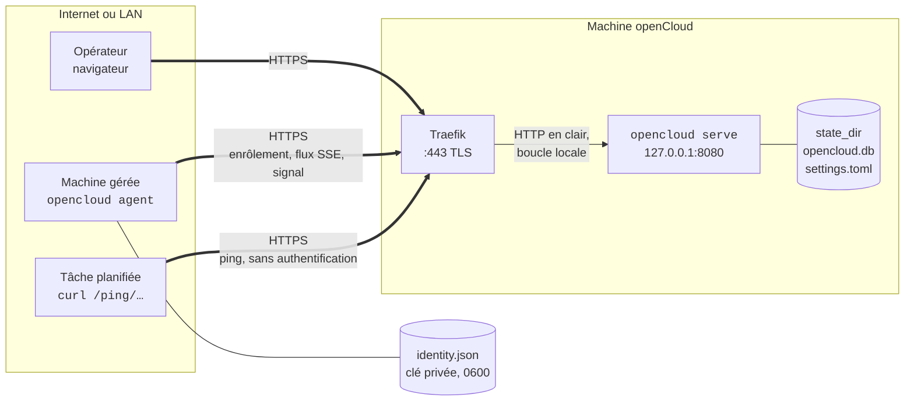

# Fonctionnement

> Ce document suit l'application. Chaque fonctionnalité intégrée y ajoute ce
> qu'elle change : un flux, un port, une donnée stockée. Dernière mise à jour :
> fonctionnalité 6, les services, le 19 septembre 2026.

## Les acteurs

| Acteur | Ce que c'est | Ce qu'il fait tourner |
| --- | --- | --- |
| L'opérateur | Lucas, dans un navigateur | Le front React, chargé une fois avec la page, qui lit l'API JSON et affiche |
| La machine openCloud | Le VPS où openCloud est installé | `opencloud serve` : l'API, le front embarqué, la base, et le rôle d'agent pour elle-même |
| Une machine | Un VPS, une VM, un NAS, que openCloud gère sans l'héberger | `opencloud agent` : le démon qui parle à openCloud, mesure la machine et veille son Docker |
| Docker | Le démon de conteneurs d'une machine, s'il y en a un | Les services : l'agent le lit par sa socket, en lecture seule, et ne lui demande jamais rien d'autre |
| Traefik | Le proxy de la machine openCloud | Termine TLS et transmet à openCloud sur la boucle locale |
| Une tâche | Un cron, une sauvegarde, un script, n'importe où | Un `curl` sur son URL de ping quand elle démarre ou finit |

Un seul binaire, `opencloud`, deux rôles. La machine openCloud est une Machine
comme les autres dans l'interface, sans démon à part.

## Le schéma

Trait double : chiffré. Trait simple : en clair, mais sans quitter la machine.

## Ce qui est chiffré, ce qui ne l'est pas

| Flux | D'où à où | Chiffrement | Qui prouve quoi |
| --- | --- | --- | --- |
| Interface | navigateur → Traefik | TLS de Traefik | Personne encore : pas d'authentification dans le socle, c'est un trou connu. Le front charge la page, puis parle à `/api/…` en JSON |
| Interface | Traefik → openCloud | En clair, sur `127.0.0.1` de la même machine | Toute écriture de l'API exige la même origine : `Sec-Fetch-Site` et un corps `application/json`. Pas de cookie : rien à voler tant qu'il n'y a pas de session |
| Direct | navigateur → `/api/events`, une connexion par onglet | TLS de Traefik | Personne : le flux ne dit que « les machines ont changé », « les tâches ont changé », jamais lesquelles. Plafond de 64 onglets, `503` au-delà |
| Agent | machine → Traefik | TLS de Traefik, ou empreinte épinglée par `-pin` si pas de domaine | Ed25519 : l'agent signe un défi, openCloud vérifie avec la clé enrôlée. Le signal porte les mesures de la machine et ce que son Docker a montré ; les journaux d'un conteneur remontent par `POST /agent/logs/…`, jeton de session |
| Agent, sens retour | openCloud → machine, sur le flux ouvert | Le même flux | Le serveur pousse « suis les journaux du conteneur X », « arrête » ; l'agent ne reçoit que ce que le serveur a tiré, jamais une entrée du navigateur |
| Journaux | navigateur → `/api/services/{id}/logs/stream` | TLS de Traefik | Personne : qui atteint le port lit les journaux de n'importe quel conteneur. C'est le même trou que l'interface, en plus lourd. Une seconde connexion par onglet, plafonnée à 16 |
| Docker | agent → `/var/run/docker.sock` | Aucun : une socket Unix de la machine | Les droits Unix : l'agent est root, `opencloud serve` doit lire la socket lui aussi (root, ou le groupe `docker`, qui vaut root). Le client ne connaît aucun verbe qui écrit |
| Agent | Traefik → openCloud | En clair, boucle locale | `X-Forwarded-*` cru seulement depuis `trusted_proxies` |
| Agent en dev | machine → `http://127.0.0.1` | Aucun, et c'est accepté : rien ne sort de la machine | Idem |
| Agent sur un LAN | machine → `http://192.168.…` | **Refusé** par l'agent, sauf `-allow-plain` | Réservé à un réseau déjà chiffré, WireGuard par exemple |
| Ping | tâche → Traefik → `/ping/{jeton}` | TLS de Traefik | Personne : le jeton dans l'URL est le secret. Qui l'a peut faire passer une tâche pour faite |

Donc non, rien ne passe en clair sur le LAN de l'infra : le seul clair est sur
la boucle locale de la machine openCloud, entre Traefik et le processus. Entre
deux machines, l'agent exige HTTPS, ou qu'on lui dise explicitement que le
réseau est déjà chiffré.

## Ce qui est stocké, et où

| Où | Fichier | Contenu | Protection |
| --- | --- | --- | --- |
| Machine openCloud, `state_dir` | `opencloud.db` | Les machines, les jetons d'enrôlement | Jetons stockés hachés : une copie de la base n'enrôle personne |
| Machine openCloud, `state_dir` | `opencloud.db` | Les moniteurs de tâches et leur jeton de ping, **en clair** : la page doit le réafficher | Une copie de la base donne les URL de ping ; on peut supprimer et recréer un moniteur |
| Machine openCloud, `state_dir` | `opencloud.db` | Les pings bruts (forme, source, méthode, corps tronqué à 10 Kio) et les exécutions (début, fin, durée, code) | Purgés : pings après 7 jours, exécutions après 90 jours |
| Machine openCloud, `state_dir` | `opencloud.db` | Les ressources mesurées par machine : le brut toutes les 10 s dans `machine_samples`, ses volumes dans `machine_disks`, les moyennes horaires dans `machine_samples_hourly`, les journalières dans `machine_samples_daily` | Purgés : brut et volumes après 48 h, horaire après 90 jours, journalier après un an. La machine retirée emporte tout |
| Machine openCloud, `state_dir` | `opencloud.db` | Les services : une fiche par conteneur dans `services` (nom, projet Compose, image, état Docker, code de sortie, santé, ports publiés, dates), ses transitions dans `service_transitions`, ses mesures dans `service_samples`, ce que chaque machine dit de son Docker dans `machine_engines` | Purgés : transitions après 90 jours, fiche d'un conteneur détruit après 30 jours avec ses transitions et mesures, mesures après 48 h. **L'extrait de journal** d'un arrêt anormal (50 lignes, 10 Kio) est stocké en clair sur la transition : ce qu'une application écrit dans ses logs peut s'y trouver |
| Machine openCloud, `state_dir` | `settings.toml` | La langue de l'interface | Écriture atomique |
| Machine gérée, `/var/lib/opencloud/agent` | `identity.json` | Clé privée Ed25519, identifiant, adresse d'openCloud, empreinte, langue | Mode 0600 ; le perdre impose un ré-enrôlement |

Le jeton en clair n'existe qu'à deux endroits, un instant : l'écran qui l'affiche
une fois, et la commande qui le passe à l'agent.

## Comment une machine entre

1. L'opérateur nomme la machine. openCloud tire un jeton, en garde l'empreinte,
   affiche le clair une seule fois avec la commande à coller.
2. Sur la machine : `sudo opencloud agent -server https://… -token oc_…`. L'agent
   tire une clé Ed25519 et un identifiant, envoie sa clé publique et le jeton.
3. openCloud consomme le jeton et crée la machine dans une seule transaction :
   deux agents avec le même jeton, un seul passe. Le jeton ne sert plus jamais.
4. À chaque connexion, l'agent demande un défi, le signe, ouvre un flux qui reste
   ouvert. En ligne, c'est ce flux. « Vu il y a », c'est le dernier signal,
   envoyé toutes les 30 s.
5. Flux coupé : l'agent revient avec un délai croissant, 1 s à 60 s. Machine
   retirée : l'agent s'arrête et le dit. Ré-enrôler garde l'identifiant et
   l'historique, seule la clé change.

## Comment une tâche est surveillée

1. L'opérateur crée un moniteur : un nom, un intervalle, une grâce, une
   machine facultative. openCloud tire un identifiant pour la page et un
   jeton `hb_…` pour l'URL de ping. Le moniteur est « Nouveau » : rien n'est
   attendu tant qu'aucun ping n'est arrivé.
2. La tâche appelle l'URL, en GET ou en POST, sans authentification :
   `/ping/{jeton}` quand elle a fini, `/ping/{jeton}/start` quand elle
   démarre, `/ping/{jeton}/{code}` quand elle finit avec ce code de sortie.
   Chaque ping repousse l'échéance à maintenant + intervalle + grâce.
3. Un `start` ouvre une exécution ; la fin la clôt avec sa durée et son code.
   Un `start` sans fin est clos en « Dépassée » par le `start` suivant ou par
   l'échéance. Un code de sortie autre que 0 met le moniteur « En échec ».
4. Toutes les 15 s, une boucle passe « En retard » les moniteurs dont
   l'échéance est dépassée. Le prochain ping les remet « À l'heure ».
5. En pause, un moniteur n'a plus d'échéance ; un ping le reprend. Supprimé,
   son URL répond 404 et son historique disparaît avec lui.

Le ping est écrit en une seule transaction : ping brut, exécution, état du
moniteur. La source notée est l'adresse résolue par `trusted_proxies` ; un
relais par l'agent, s'il vient un jour, y écrira `agent:<machine>` sans
changer le schéma.

## Comment une machine est mesurée

1. L'agent lit `/proc/stat`, `/proc/meminfo`, `/proc/loadavg`, `/proc/net/dev`
   et `/proc/mounts` toutes les 10 s, puis fait un `statfs` par volume. Le
   processeur et le réseau sont des deltas entre deux lectures : un
   pourcentage actif, un débit en octets par seconde hors boucle locale. La
   mémoire, le swap, la charge sur une minute, le nombre de cœurs et les
   volumes sont instantanés.
2. Un volume est un système de fichiers de disque monté : ext2 à ext4, xfs,
   btrfs, zfs, f2fs, jfs, vfat, exfat, ntfs, ntfs3, fuseblk. Le reste ne
   compte pas : les pseudo-systèmes du noyau et les tmpfs, l'overlay des
   conteneurs, les images en boucle (`/dev/loop…`, dont les snaps), les
   montages réseau (nfs, cifs), et tout ce qui est monté sous `/boot`,
   `/snap`, `/var/lib/docker` et `/var/lib/containers`. Un même
   périphérique monté plusieurs fois, `/` et `/home` sur un btrfs par
   exemple, fait un seul volume, nommé par son point de montage le plus
   court. Un volume qui ne se mesure pas est laissé de côté, jamais montré à
   zéro. `disk_used` et `disk_total` font la somme des volumes.
3. Les lectures attendent dans un tampon en mémoire d'une heure au plus. Le
   signal de toutes les 30 s les emporte dans son corps, par lots de 120 ; un
   rattrapage après une coupure enchaîne les signaux jusqu'à vider le tampon.
   Un redémarrage de l'agent perd le tampon : pas de spool sur disque.
4. La machine openCloud se mesure elle-même dans `opencloud serve`, à la même
   cadence, sans passer par le réseau : c'est son rôle d'agent.
5. openCloud refuse en bloc un lot dont une lecture est hors de mesure
   (pourcentage hors de 0 à 100, nombre négatif, date à plus de cinq minutes
   dans le futur ou plus vieille que le brut gardé, volume sans point de
   montage absolu ou compté deux fois, plus de 32 volumes) ; le signal de
   vie compte quand même. Une lecture déjà en base, rejouée, est ignorée,
   ses volumes avec.
6. Toutes les 5 min, le rollup rejoue tous les seaux horaires que le brut
   couvre encore, puis les seaux journaliers, en une instruction SQL par seau
   qui réécrit le seau s'il existe. Pas de curseur : un redémarrage ou un
   rattrapage se corrige seul. Le journalier est pondéré par le nombre
   d'échantillons de chaque heure.
7. La purge, au départ puis une fois par jour, efface chaque étage au-delà de
   sa rétention. Chaque fenêtre lit une table gardée strictement plus
   longtemps qu'elle : une purge ne tronque jamais une lecture en cours.

| Fenêtre | Table lue | Pas des points |
| --- | --- | --- |
| 1 h | brut | 10 s |
| 24 h | brut, groupé | 5 min |
| 7 j, 30 j | horaire | 1 h |
| 90 j | journalier | 1 jour, en UTC |

La valeur courante est le dernier échantillon en base. Passé 90 s sans
échantillon, la machine est « indisponible » : l'API dit `available: false`
et le front affiche un tiret et l'âge de la dernière mesure, jamais un zéro.
L'API rend des faits : octets, octets par seconde, pourcentage processeur ;
les pourcentages de mémoire et de disque et les unités lisibles se
calculent dans le navigateur.

## Comment les services sont suivis

Un service est une application qui tourne sur une machine. Aujourd'hui,
un service est un conteneur Docker ; la fiche porte un genre pour qu'une
application native en soit un aussi plus tard. Le projet Compose est un
groupe, pas une entité : `nextcloud` et `nextcloud-db` sont deux services
du groupe `nextcloud`, comme sur la planche « Machine ».

1. L'agent sonde la socket Docker au départ puis toutes les 60 s tant
   qu'elle ne répond pas, en lecture seule, API Engine épinglée à `1.41`
   (Docker 20.10, celui de Debian 12) ; un démon plus vieux est refusé. Il
   dit à openCloud si Docker est présent, sinon pourquoi : pas de socket,
   pas le droit, démon muet, trop vieux. Ce n'est pas une erreur : la
   machine n'a aucun service, et l'interface l'écrit.
2. Docker répond : l'agent liste et inspecte chaque conteneur (un
   `docker compose run` est laissé de côté), envoie l'inventaire complet,
   puis le redonne toutes les 5 min. Une fiche que l'inventaire ne nomme
   plus est archivée. Un conteneur qui réapparaît avec le même id
   retrouve sa fiche.
3. Entre deux inventaires, l'agent suit le flux d'événements de Docker et
   traduit `create`, `start`, `die`, `pause`, `unpause`, `destroy`,
   `health_status`, `rename` ; `kill` et `stop` ne changent rien par
   eux-mêmes, le `die` qui suit porte l'état et le code de sortie. Chaque
   événement repart avec le conteneur réinspecté. Sur un `die` à code hors
   0, 137 ou 143, l'agent capture les 50 dernières lignes du journal. Une
   coupure du flux repart de l'horodatage du dernier événement reçu.
4. Toutes les 30 s, l'agent mesure chaque conteneur qui tourne en un appel
   (`stats?one-shot`) : le processeur est un delta entre deux mesures, en
   pourcentage d'un cœur (200 % = deux cœurs), la mémoire est l'usage moins
   le cache de fichiers, comme `docker stats`. Un compteur qui recule
   (conteneur relancé) vaut une première mesure : rien ce tour.
5. Tout attend dans un tampon en mémoire et part dans le corps du signal,
   section `services` à côté des lectures. Après une reconnexion, ce qui
   attendait est marqué **rejoué** : le serveur l'écrit, mais la feature
   alertes n'y verra pas du neuf. Un agent plus vieux n'envoie pas de
   section : le serveur l'accepte.
6. openCloud refuse en bloc un rapport hors de mesure (plus de 256
   conteneurs, 512 événements ou 1 024 mesures, un id qui n'est pas un id
   Docker, un état inconnu, une date dans le futur, un port hors bornes) ;
   le signal de vie compte quand même. Sinon il écrit tout en une
   transaction : fiches, transitions (une par changement d'état ou de
   santé, jamais par événement sans changement), mesures, état du Docker.
   La machine openCloud fait tout cela dans `opencloud serve`, sans réseau.
7. Le serveur rend des faits : l'état Docker brut, le code de sortie, la
   santé. Le navigateur en fait les pastilles : Actif, Démarre,
   Défaillant, Redémarre, En pause, Arrêté ; un `exited` à 0, 137 ou 143
   est « Arrêté », tout autre code « Défaillant ». Le compteur de la barre
   latérale passe en rouge dès qu'un service est défaillant ou redémarre.
8. Les journaux : l'opérateur ouvre une fiche, le serveur tire un
   identifiant de requête et pousse `logs` sur le flux de l'agent ; l'agent
   ouvre le journal (100 lignes par défaut, 500 au plus) et livre des lots
   toutes les secondes ou toutes les 64 lignes par `POST /agent/logs/{id}`,
   que le serveur relaie au navigateur en SSE. L'onglet fermé, le serveur
   pousse `logs_stop`. Quatre suivis par machine, seize en tout ; au-delà,
   refusé avec la clé du catalogue. Le navigateur garde 1 200 lignes et
   retombe sur un tirage unique si le direct échoue avant la première
   ligne. Une machine hors ligne le dit, sans attendre.
9. La purge, au départ puis une fois par jour, efface les transitions de
   plus de 90 jours, les fiches archivées depuis plus de 30 jours (leurs
   transitions et mesures partent avec) et les mesures de plus de 48 h.

| Ce que l'agent lit | Où | Ce qu'il en garde |
| --- | --- | --- |
| `GET /_ping` | en-têtes `Api-Version`, `Server` | présent, version, version d'API |
| `GET /containers/json?all=1` | liste | id, labels Compose, état |
| `GET /containers/{id}/json` | inspect | nom, image et son empreinte, état, code de sortie, santé, redémarrages, ports publiés, dates |
| `GET /events?filters=container` | flux | action, id, instant, code de sortie |
| `GET /containers/{id}/stats?one-shot` | mesure | compteurs processeur, mémoire, limite |
| `GET /containers/{id}/logs` | journal multiplexé | lignes horodatées, stdout et stderr |

Pas de label `opencloud.*` : openCloud déclarera ses services plus tard,
les labels viendront avec. Les ports publiés s'affichent dans la colonne
Domaine en attendant les domaines ; l'empreinte d'image attend les mises à
jour ; les réseaux et dépendances viendront avec l'inspection réseau.

## Comment l'interface se met à jour sans recharger

1. La coquille React ouvre `/api/events` en `EventSource` ; le serveur
   répond `connected`, puis un commentaire toutes les 15 s pour tenir la
   connexion derrière Traefik.
2. `machine`, `heartbeat`, `resource` et `service` publient sur le bus
   interne (`internal/live`) à chaque changement visible : jeton,
   enrôlement, connexion, signal, déconnexion, retrait ; création, ping,
   échéance dépassée, pause, reprise, suppression ; lot de mesures écrit ;
   rapport de services écrit. Le bus ne porte que quatre sujets,
   `machines`, `jobs`, `resources` et `services`.
3. Chaque onglet reçoit le sujet, et le front relit la ressource qui va
   avec par l'API : la liste, la fiche, les compteurs. Rien d'autre ne
   voyage dans le flux.
4. Un onglet lent voit ses sujets fusionnés : cent signaux non lus font un
   seul `machines`. Rien ne se perd, rien ne s'accumule.
5. Connexion coupée : le navigateur revient seul après 5 s avec
   `Last-Event-ID` ; le serveur répond `reconnected` et le front relit tout.
   **Rien n'est rejoué** : ce qui s'est passé pendant la coupure se voit au
   retour, pas événement par événement.

L'agent garde son propre flux `/agent/stream`, authentifié, qui porte
aussi les commandes du serveur ; le journal d'un service ouvre un
troisième flux, `/api/services/{id}/logs/stream`, un par fiche ouverte.
Tous traversent la même chaîne de middlewares (panique, identifiant de
requête, journal, limite de corps à 1 Mio), qui relaie `Flush`.

### Limitation de débit sur `/ping`

| Clé | Débit continu | Rafale | Sert à |
| --- | --- | --- | --- |
| Adresse source résolue | 10 par seconde | 20 | Freiner l'énumération de jetons : les 404 comptent |
| Jeton | 1 toutes les 2 s | 30 | Qu'un jeton fuité ne remplisse pas la base |

Au-delà : `429` avec `Retry-After`. Derrière Traefik sans `trusted_proxies`,
tous les pings semblent venir de la boucle locale et partagent un seul seau.

## Ports

| Port | Où | Sert à |
| --- | --- | --- |
| 8080 | `127.0.0.1` de la machine openCloud, réglable par `listen` | Tout : interface et agents, derrière Traefik |
| 443 | Traefik | L'entrée publique, interface et agents sur le même nom |

Un seul port derrière Traefik : les agents appellent `/agent/…`, les tâches
`/ping/…`, l'opérateur le reste. Pas de port à part.

## Vérifié le 13 septembre 2026

Traefik v3 en Docker, certificat auto-signé, agent lancé avec `-pin` : enrôlement,
flux et signaux passent en HTTP/2 sur TLS. Le flux a tenu 201 s sans coupure,
6 signaux, au-delà du `readTimeout` de 60 s et de l'`idleTimeout` de 180 s de
Traefik, parce que c'est la réponse qui dure, pas la requête. Une mauvaise
empreinte, un auto-signé sans empreinte, `http://` vers une adresse de LAN :
refusés avant d'envoyer quoi que ce soit.

## Ce qui manque encore

| Manque | Conséquence aujourd'hui | Quand |
| --- | --- | --- |
| Authentification de l'interface | Qui atteint le port web peut tout faire, par l'API comme par l'interface, dont créer un jeton | Socle, à décider |
| TLS servi par openCloud lui-même | Sans Traefik ni domaine, il faut `-pin` sur un certificat tiers | À part |
| Téléchargement du binaire, unité systemd | La commande d'installation suppose le binaire présent | À part |
| Spool côté agent | Une coupure de plus d'une heure, ou un redémarrage de l'agent, perd des mesures : un trou dans l'historique | Avec les premiers événements à rejouer |
| Pas d'historique par volume | Les graphes et la vue d'ensemble montrent la somme des volumes ; le détail par volume n'existe que pour la valeur courante | À décider |
| Pas d'historique par service | La mesure d'un service ne vit que 48 h, sans graphe ; la fiche montre la valeur courante | À décider |
| Pas de spool des services | Un redémarrage de l'agent perd les événements en attente ; l'inventaire suivant remet les fiches d'aplomb, sans les transitions manquées | Avec le spool des mesures |
| Journaux lisibles sans authentification | Qui atteint le port lit les journaux de tous les conteneurs | Socle, avec l'authentification |
| `serve` sans accès à la socket | La machine openCloud dit « Docker absent » alors qu'il tourne ; l'unité systemd devra mettre le service dans le groupe `docker` ou en root | Avec l'unité systemd |
| Alerte sur une ressource | Le disque à 86 % se voit en jauge orange, personne n'est prévenu | Fonctionnalité 11 |
| Alerte sur une tâche | « En retard » et « En échec » se voient dans les pages et se comptent, personne n'est prévenu | Fonctionnalité 11, par l'interface `heartbeat.Listener` |
| Rotation du jeton de ping | Un jeton fuité impose de supprimer et recréer le moniteur | À décider |

## Par fonctionnalité

| Fonctionnalité | Ce qu'elle a ajouté ici |
| --- | --- |
| 2 · multihost | Tout ce document : machines, agent, enrôlement, flux, signal, base et migrations |
| 3 · heartbeats | Les routes publiques `/ping/…`, les tables `heartbeats`, `heartbeat_pings`, `heartbeat_runs`, la rétention, la limitation de débit, la boucle d'échéance |
| Front React | L'API JSON sous `/api/…`, le front embarqué dans le binaire, la garde même-origine à la place du cookie anti-CSRF ; les temps relatifs se calculent dans le navigateur |
| 4 · direct | Le bus `internal/live`, le flux `/api/events`, la chaîne de middlewares et `X-Request-ID`, la clé `log_level` de la configuration |
| 5 · ressources | La mesure par l'agent et par `serve`, le corps du signal, les tables `machine_samples*` et `machine_disks`, le rollup et la purge, les routes `/api/resources` et `/api/machines/{id}/resources[/history]`, le sujet `resources` |
| 6 · services | Le veilleur Docker de l'agent et de `serve`, la section `services` du signal, les commandes sur `/agent/stream` et `POST /agent/logs/{request}`, les tables `services`, `service_transitions`, `service_samples`, `machine_engines`, la clé `docker_socket` et le drapeau `-docker-socket`, les routes `/api/services…` et `/api/machines/{id}/services`, le sujet `services` |
