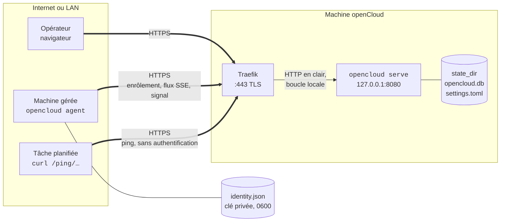

# Fonctionnement

> Ce document suit l'application. Chaque fonctionnalité intégrée y ajoute ce
> qu'elle change : un flux, un port, une donnée stockée. Dernière mise à jour :
> fonctionnalité 4, le direct, le 13 septembre 2026.

## Les acteurs

| Acteur | Ce que c'est | Ce qu'il fait tourner |
| --- | --- | --- |
| L'opérateur | Lucas, dans un navigateur | Le front React, chargé une fois avec la page, qui lit l'API JSON et affiche |
| La machine openCloud | Le VPS où openCloud est installé | `opencloud serve` : l'API, le front embarqué, la base, et le rôle d'agent pour elle-même |
| Une machine | Un VPS, une VM, un NAS, que openCloud gère sans l'héberger | `opencloud agent` : le démon qui parle à openCloud |
| Traefik | Le proxy de la machine openCloud | Termine TLS et transmet à openCloud sur la boucle locale |
| Une tâche | Un cron, une sauvegarde, un script, n'importe où | Un `curl` sur son URL de ping quand elle démarre ou finit |

Un seul binaire, `opencloud`, deux rôles. La machine openCloud est une Machine
comme les autres dans l'interface, sans démon à part.

## Le schéma

Trait double : chiffré. Trait simple : en clair, mais sans quitter la machine.

## Ce qui est chiffré, ce qui ne l'est pas

| Flux | D'où à où | Chiffrement | Qui prouve quoi |
| --- | --- | --- | --- |
| Interface | navigateur → Traefik | TLS de Traefik | Personne encore : pas d'authentification dans le socle, c'est un trou connu. Le front charge la page, puis parle à `/api/…` en JSON |
| Interface | Traefik → openCloud | En clair, sur `127.0.0.1` de la même machine | Toute écriture de l'API exige la même origine : `Sec-Fetch-Site` et un corps `application/json`. Pas de cookie : rien à voler tant qu'il n'y a pas de session |
| Direct | navigateur → `/api/events`, une connexion par onglet | TLS de Traefik | Personne : le flux ne dit que « les machines ont changé », « les tâches ont changé », jamais lesquelles. Plafond de 64 onglets, `503` au-delà |
| Agent | machine → Traefik | TLS de Traefik, ou empreinte épinglée par `-pin` si pas de domaine | Ed25519 : l'agent signe un défi, openCloud vérifie avec la clé enrôlée |
| Agent | Traefik → openCloud | En clair, boucle locale | `X-Forwarded-*` cru seulement depuis `trusted_proxies` |
| Agent en dev | machine → `http://127.0.0.1` | Aucun, et c'est accepté : rien ne sort de la machine | Idem |
| Agent sur un LAN | machine → `http://192.168.…` | **Refusé** par l'agent, sauf `-allow-plain` | Réservé à un réseau déjà chiffré, WireGuard par exemple |
| Ping | tâche → Traefik → `/ping/{jeton}` | TLS de Traefik | Personne : le jeton dans l'URL est le secret. Qui l'a peut faire passer une tâche pour faite |

Donc non, rien ne passe en clair sur le LAN de l'infra : le seul clair est sur
la boucle locale de la machine openCloud, entre Traefik et le processus. Entre
deux machines, l'agent exige HTTPS, ou qu'on lui dise explicitement que le
réseau est déjà chiffré.

## Ce qui est stocké, et où

| Où | Fichier | Contenu | Protection |
| --- | --- | --- | --- |
| Machine openCloud, `state_dir` | `opencloud.db` | Les machines, les jetons d'enrôlement | Jetons stockés hachés : une copie de la base n'enrôle personne |
| Machine openCloud, `state_dir` | `opencloud.db` | Les moniteurs de tâches et leur jeton de ping, **en clair** : la page doit le réafficher | Une copie de la base donne les URL de ping ; on peut supprimer et recréer un moniteur |
| Machine openCloud, `state_dir` | `opencloud.db` | Les pings bruts (forme, source, méthode, corps tronqué à 10 Kio) et les exécutions (début, fin, durée, code) | Purgés : pings après 7 jours, exécutions après 90 jours |
| Machine openCloud, `state_dir` | `settings.toml` | La langue de l'interface | Écriture atomique |
| Machine gérée, `/var/lib/opencloud/agent` | `identity.json` | Clé privée Ed25519, identifiant, adresse d'openCloud, empreinte, langue | Mode 0600 ; le perdre impose un ré-enrôlement |

Le jeton en clair n'existe qu'à deux endroits, un instant : l'écran qui l'affiche
une fois, et la commande qui le passe à l'agent.

## Comment une machine entre

1. L'opérateur nomme la machine. openCloud tire un jeton, en garde l'empreinte,
   affiche le clair une seule fois avec la commande à coller.
2. Sur la machine : `sudo opencloud agent -server https://… -token oc_…`. L'agent
   tire une clé Ed25519 et un identifiant, envoie sa clé publique et le jeton.
3. openCloud consomme le jeton et crée la machine dans une seule transaction :
   deux agents avec le même jeton, un seul passe. Le jeton ne sert plus jamais.
4. À chaque connexion, l'agent demande un défi, le signe, ouvre un flux qui reste
   ouvert. En ligne, c'est ce flux. « Vu il y a », c'est le dernier signal,
   envoyé toutes les 30 s.
5. Flux coupé : l'agent revient avec un délai croissant, 1 s à 60 s. Machine
   retirée : l'agent s'arrête et le dit. Ré-enrôler garde l'identifiant et
   l'historique, seule la clé change.

## Comment une tâche est surveillée

1. L'opérateur crée un moniteur : un nom, un intervalle, une grâce, une
   machine facultative. openCloud tire un identifiant pour la page et un
   jeton `hb_…` pour l'URL de ping. Le moniteur est « Nouveau » : rien n'est
   attendu tant qu'aucun ping n'est arrivé.
2. La tâche appelle l'URL, en GET ou en POST, sans authentification :
   `/ping/{jeton}` quand elle a fini, `/ping/{jeton}/start` quand elle
   démarre, `/ping/{jeton}/{code}` quand elle finit avec ce code de sortie.
   Chaque ping repousse l'échéance à maintenant + intervalle + grâce.
3. Un `start` ouvre une exécution ; la fin la clôt avec sa durée et son code.
   Un `start` sans fin est clos en « Dépassée » par le `start` suivant ou par
   l'échéance. Un code de sortie autre que 0 met le moniteur « En échec ».
4. Toutes les 15 s, une boucle passe « En retard » les moniteurs dont
   l'échéance est dépassée. Le prochain ping les remet « À l'heure ».
5. En pause, un moniteur n'a plus d'échéance ; un ping le reprend. Supprimé,
   son URL répond 404 et son historique disparaît avec lui.

Le ping est écrit en une seule transaction : ping brut, exécution, état du
moniteur. La source notée est l'adresse résolue par `trusted_proxies` ; un
relais par l'agent, s'il vient un jour, y écrira `agent:<machine>` sans
changer le schéma.

## Comment l'interface se met à jour sans recharger

1. La coquille React ouvre `/api/events` en `EventSource` ; le serveur
   répond `connected`, puis un commentaire toutes les 15 s pour tenir la
   connexion derrière Traefik.
2. `machine` et `heartbeat` publient sur le bus interne (`internal/live`) à
   chaque changement visible : jeton, enrôlement, connexion, signal,
   déconnexion, retrait ; création, ping, échéance dépassée, pause, reprise,
   suppression. Le bus ne porte que deux sujets, `machines` et `jobs`.
3. Chaque onglet reçoit le sujet, et le front relit la ressource qui va
   avec par l'API : la liste, la fiche, les compteurs. Rien d'autre ne
   voyage dans le flux.
4. Un onglet lent voit ses sujets fusionnés : cent signaux non lus font un
   seul `machines`. Rien ne se perd, rien ne s'accumule.
5. Connexion coupée : le navigateur revient seul après 5 s avec
   `Last-Event-ID` ; le serveur répond `reconnected` et le front relit tout.
   **Rien n'est rejoué** : ce qui s'est passé pendant la coupure se voit au
   retour, pas événement par événement.

L'agent garde son propre flux `/agent/stream`, authentifié ; les deux flux
traversent la même chaîne de middlewares (panique, identifiant de requête,
journal, limite de corps à 1 Mio), qui relaie `Flush`.

### Limitation de débit sur `/ping`

| Clé | Débit continu | Rafale | Sert à |
| --- | --- | --- | --- |
| Adresse source résolue | 10 par seconde | 20 | Freiner l'énumération de jetons : les 404 comptent |
| Jeton | 1 toutes les 2 s | 30 | Qu'un jeton fuité ne remplisse pas la base |

Au-delà : `429` avec `Retry-After`. Derrière Traefik sans `trusted_proxies`,
tous les pings semblent venir de la boucle locale et partagent un seul seau.

## Ports

| Port | Où | Sert à |
| --- | --- | --- |
| 8080 | `127.0.0.1` de la machine openCloud, réglable par `listen` | Tout : interface et agents, derrière Traefik |
| 443 | Traefik | L'entrée publique, interface et agents sur le même nom |

Un seul port derrière Traefik : les agents appellent `/agent/…`, les tâches
`/ping/…`, l'opérateur le reste. Pas de port à part.

## Vérifié le 13 septembre 2026

Traefik v3 en Docker, certificat auto-signé, agent lancé avec `-pin` : enrôlement,
flux et signaux passent en HTTP/2 sur TLS. Le flux a tenu 201 s sans coupure,
6 signaux, au-delà du `readTimeout` de 60 s et de l'`idleTimeout` de 180 s de
Traefik, parce que c'est la réponse qui dure, pas la requête. Une mauvaise
empreinte, un auto-signé sans empreinte, `http://` vers une adresse de LAN :
refusés avant d'envoyer quoi que ce soit.

## Ce qui manque encore

| Manque | Conséquence aujourd'hui | Quand |
| --- | --- | --- |
| Authentification de l'interface | Qui atteint le port web peut tout faire, par l'API comme par l'interface, dont créer un jeton | Socle, à décider |
| TLS servi par openCloud lui-même | Sans Traefik ni domaine, il faut `-pin` sur un certificat tiers | À part |
| Téléchargement du binaire, unité systemd | La commande d'installation suppose le binaire présent | À part |
| Spool côté agent | Un signal perdu pendant une coupure est perdu | Avec les premiers événements à rejouer |
| L'agent ne mesure rien | Ni conteneurs, ni ressources | Fonctionnalités 5, 6 |
| Alerte sur une tâche | « En retard » et « En échec » se voient dans les pages et se comptent, personne n'est prévenu | Fonctionnalité 11, par l'interface `heartbeat.Listener` |
| Rotation du jeton de ping | Un jeton fuité impose de supprimer et recréer le moniteur | À décider |

## Par fonctionnalité

| Fonctionnalité | Ce qu'elle a ajouté ici |
| --- | --- |
| 2 · multihost | Tout ce document : machines, agent, enrôlement, flux, signal, base et migrations |
| 3 · heartbeats | Les routes publiques `/ping/…`, les tables `heartbeats`, `heartbeat_pings`, `heartbeat_runs`, la rétention, la limitation de débit, la boucle d'échéance |
| Front React | L'API JSON sous `/api/…`, le front embarqué dans le binaire, la garde même-origine à la place du cookie anti-CSRF ; les temps relatifs se calculent dans le navigateur |
| 4 · direct | Le bus `internal/live`, le flux `/api/events`, la chaîne de middlewares et `X-Request-ID`, la clé `log_level` de la configuration |
